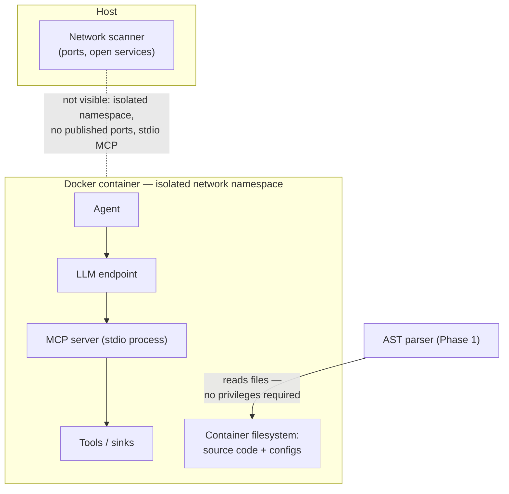

# ADR-0001: Rejection of Network Scanners and Adoption of the AST Approach, With Its Limitations Acknowledged

**Status:** Accepted
**Date:** 2026-10-09
**Context:** Phase 0 → Phase 1

---

## Context

AICorellator must build a graph of AI tool interactions (agents, LLMs, MCP servers, tools, sinks) in an arbitrary environment where AI components run inside Docker containers. Network scanners (NeuralScan and similar) were initially considered, but they do not apply to the target scenario.

Key constraint: a Docker container is a black box from the network's point of view. The internal interactions between the agent, LLM, and MCP servers happen inside the container network namespace. They are not visible from outside without privileged mode, eBPF, or modification of the Docker network stack.

## Options Considered

### Option A: Network Scanners

Approach: scan network ports, discover open AI services (Ollama on :11434, vLLM on :8000, MCP over HTTP).

Why it does not work in Docker:

- Container network namespace is isolated. Internal container ports are not visible from the host without `--network host` or explicit port publishing.
- AI components often do not expose ports. MCP servers run as stdio processes inside the container, not as network services.
- eBPF for runtime inspection requires privileged mode — which contradicts the "no privileges" principle.
- Dynamic analysis in Docker requires spawning or exec — not always possible and creates risks.
- Precedent: Amazon GuardDuty Runtime Monitoring uses an eBPF agent deployed as a DaemonSet. That is not this approach — it requires privileged access and does not work in isolated containers without it.

### Option B: AST Parser (static analysis)

Approach: parse the source code and configs inside the image, build the graph from static artifacts.

Advantages:

- Works without privileged mode. The AST parser reads files; it does not need root, eBPF, or kernel access.
- Works in an isolated container. Unpacking the image filesystem or mounting the sources is enough.
- Yields the structure of AI components. Agents, MCP servers, tools — these are code, not network services.

Weakness of the AST approach: runtime state is invisible.

AST sees static structure, but not:

- Which tools are actually registered at runtime (dynamic registration via `register_tool()`).
- Which MCP servers are actually connected (the configuration may live in env, not in a file).
- Which LLM endpoints are actually used (they may live in environment variables, not in code).
- Changes at runtime (rug pull, dynamic tool injection).

Precedent: mcp-shield-audit documents a real case where an MCP server declared 3 tools in source code but returned 5 at runtime — the 2 extra tools had command execution and file read. AST would not see that.

Another precedent: the MCP specification describes dynamic tool discovery — a client can discover tools at runtime via `tools/list` that were not visible statically.

### Option C: Hybrid (AST + runtime)

Approach: AST provides the base graph; runtime components (via MCP proxy or eBPF) supplement it.

Why deferred:

- Runtime requires privileged mode or modification of the target. An MCP proxy works by intercepting stdio/HTTP but requires control over the MCP server's startup. eBPF requires kernel-level access.
- The priority is the initial graph, not full runtime. The task of Phase 1 is to build the base structure that can be enriched later.
- Architectural option. The runtime component is baked into the architecture (DynamicWorker) but is not implemented in the base version.

## Decision

Adopt the AST approach as the only static method for Phase 1. Runtime inspection is an architectural option, deferred to Phase 3+.

## Rationale

- Network scanners do not work in isolated Docker containers without privileged mode. This is a fundamental limitation, not a matter of tool choice.
- AST gives 80% of the graph for 20% of the effort. Agents, MCP servers, tools, LLM endpoints — all of this is visible in code. Runtime state adds the remaining 20% but requires disproportionately large effort (privileged mode, proxy, eBPF).
- Precedents confirm AST's weakness against runtime. mcp-shield-audit found real rug-pull attacks that are invisible statically. The MCP specification describes dynamic tool discovery that is invisible in source code.
- The architecture bakes in the runtime option. The DynamicWorker interface exists. When the need appears, an implementation is added (MCP proxy, eBPF, or file watcher).

## Accepted AST Limitations

| Limitation | Impact | Mitigation |
|---|---|---|
| Dynamic tool registration | Tools registered at runtime are invisible | Accepted. Runtime option in Phase 3 |
| Dynamic tool discovery | Tools discovered via `tools/list` are invisible | Accepted. Runtime option in Phase 3 |
| Rug pull | Tool description changes after the scan are invisible | Content hash + re-scan |
| Env-based LLM endpoints | The model may live in env, not in code | LLM-extractor reads `.env`, `docker-compose.yml` |
| Runtime changes | Tool schemas change after startup | Accepted. Runtime option in Phase 3 |

## Consequences

### Positive

- Works everywhere. AST does not require privileged mode, root, eBPF, or modification of the target.
- Docker-friendly. Image unpack + AST parser — a standard pipeline.
- Fast. AST parsing takes seconds to minutes, not hours.
- Deterministic. Same code → same graph.

### Negative

- Does not see runtime. Dynamic registration, rug pull, env-based configuration — outside the visibility zone.
- Requires content hash for staleness. Without runtime monitoring, changes are only visible on re-scan.
- Does not replace a runtime-IDS. AICorellator is not a runtime-security tool. It is a correlator of static artifacts.

### Neutral

- Runtime option baked into the architecture. The DynamicWorker interface exists; there are no implementations.
- Content hash as the staleness mechanism. Nodes with a changed hash → confidence is reset, a re-scan is required.

## Deferred

- MCP proxy for runtime inspection. Requires control over the MCP server's startup.
- eBPF agent for kernel-level monitoring. Requires privileged mode.
- File watcher for change tracking. A simple DynamicWorker implementation.

## References

- mcp-shield-audit — a real rug-pull case via dynamic tool injection
- MCP specification — dynamic tool discovery
- GuardDuty Runtime Monitoring — eBPF-based, requires privileged mode

## Decision Made

The AST approach as the foundation. Runtime inspection — an architectural option, deferred to Phase 3+.

Network scanners are not applicable in isolated Docker containers. AST provides the base graph. AST's weakness (runtime invisibility) is accepted consciously — it does not block building compromise chains at the static level.

