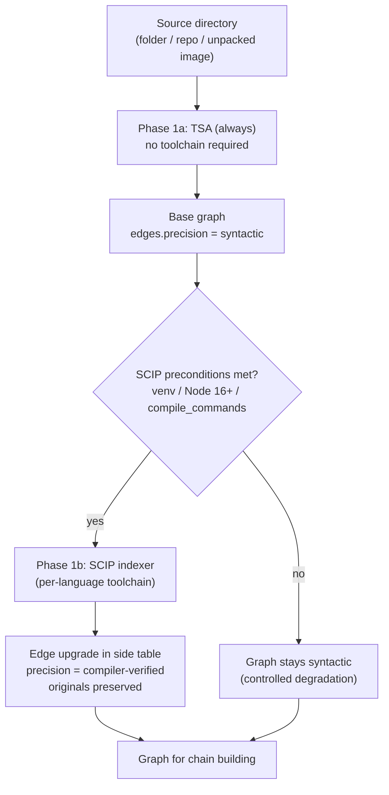

# ADR-0002: Choice of AST Parser for Base Scanning

**Status:** Proposed
**Date:** 2026-10-09
**Context:** Phase 0 → Phase 1 (AST + LLM)

---

## Context

AICorellator must build a graph of AI tool interactions (agent, llm_endpoint, mcp_server, tool) from source code. For that it needs a parser that:

- Works with multiple languages (Python, TypeScript, Go, Java, Rust, C/C++).
- Yields edges between files (who calls whom, who imports whom) — without this the connectivity graph cannot be built.
- Runs in an arbitrary container where there is no control over toolchains.
- Does not require privileged mode, root, or eBPF.
- Fits the asynchronous pipeline (Phase 2 — scanner queue).

Key constraint: AICorellator is not a SAST tool. The task is to find nodes (agent, llm_endpoint, mcp_server, tool) and the relations between them. Full dataflow, interprocedural analysis, and vulnerability discovery in code are out of scope. This means edge precision may be lower than compiler-grade tools', as long as it does not impede chain construction.

## Options Considered

### Option A: Tree-sitter Analyzer (TSA)

What it is: a Python package on top of tree-sitter that builds a symbol index and call graph for 13 languages with full support (Python, Java, JS/TS, Go, Rust, C, C++, C#, Swift, Kotlin, Ruby, PHP).

Advantages:

- Zero dependencies. `uvx --from tree-sitter-analyzer` — works without venv, Node, or a compiler.
- Docker-friendly. Ships with a ready-made Dockerfile; the server speaks stdio MCP.
- Content-hash diff cache. The index is built lazily and updated on file changes.
- Mermaid export. The built-in `viz` action `graph` yields a ready-made Mermaid call graph.
- Out-of-the-box call graphs for 13 languages, with edge-type labeling (local/self/import/stdlib/external).

Disadvantages:

- Heuristic resolution. Inter-file relations are not compiler-verified. For languages other than JS/TS/Python/Java (which have oxc/stack-graphs), resolution is approximate.
- ~4% of edges remain unknown (dynamic dispatch, constructors, ambiguous methods).
- "database is locked" under concurrent access to `.ast-cache/index.db` — manageable, but requires discipline.
- Silent misses on some languages were a problem before the 2026-05-24 patch (Swift/Kotlin/Ruby/PHP/C#).

Assessment for AICorellator: TSA provides the graph skeleton everywhere sources exist. For the task "find nodes and relations," that is sufficient. The limitations are predictable and not critical for the scope.

### Option B: SCIP (Source Code Intelligence Protocol)

What it is: a language-agnostic protocol for code indexing. Each language has its own indexer (scip-python, scip-typescript, scip-go, scip-java, scip-clang, rust-analyzer scip). The result is a `.scip` file (protobuf) that the consumer parses once.

Advantages:

- Compiler-grade precision. scip-python — a Pyright fork, type-aware resolution. scip-typescript — type-resolved cross-package references.
- Single protocol. One consumer for all languages. No per-language parsers to write.
- Precision layer over tree-sitter. Can be used as an oracle: tree-sitter gives heuristic edges, SCIP upgrades them to Compiler confidence.
- 8 languages with GA status on Sourcegraph: Go, TypeScript, JavaScript, Python, Java, Scala, Kotlin, Rust.

Disadvantages:

- Requires toolchains. scip-python needs Python 3.10+, Node 16+, an activated venv. scip-clang — `compile_commands.json`. scip-java — Gradle/Maven.
- Full-project only. Indexing does not support file-level updates — the whole project is re-indexed.
- The index is a static snapshot. It must be regenerated after changes. No auto-update.
- Index size — 10–100 MB+ for large projects.
- Not all languages are mature. scip-python has no GitHub releases, npm only. scip-go migrated from sourcegraph/scip-go to scip-code/scip-go.
- A fallback is mandatory. If the indexer fails (broken build, missing deps) — degrade to tree-sitter.

Assessment for AICorellator: SCIP gives precise edges but does not work in an arbitrary container without toolchains. In the multi-host, multi-language scenario this means: SCIP is applicable only where the toolchain is known and controlled.

### Option C: Hybrid (TSA as base, SCIP as precision layer)

What it is: TSA always provides the base graph. SCIP runs conditionally — if the indexer's preconditions are met — and upgrades edges to compiler-verified.

Precedents:

- CodeLens: SCIP as a precision layer, tree-sitter as fallback. The SCIP backend gives confidence 0.98 vs 0.85 for tree-sitter.
- rag-rat oracle: SCIP edges are tagged Compiler, heuristic edges are kept in a side table. "The original heuristic resolution on the edge is never overwritten."
- Sruja: "If the indexer fails due to compilation errors, notify the user and proceed with standard Tree-sitter discovery (lower confidence)."

Architecture:

Pros:

- Never left without a graph. TSA always provides the base.
- Precision where possible. SCIP strengthens the graph without replacing it.
- Controlled degradation. SCIP unavailable → graph marked syntactic, chains are built with lower confidence.

Cons:

- More complex. Two parsers, two data models, merge logic.
- The SCIP index must be generated. Per language: its own indexer, its own toolchain.

## Decision

Adopt the hybrid approach: TSA as Phase 1 (always), SCIP as Phase 2 (conditionally).

## Rationale

- The task is to find nodes and relations, not to build a perfect AST. TSA is sufficient for this task. SCIP — strengthening, not replacement.
- Arbitrary container — the main constraint. TSA works without toolchains. SCIP requires venv/Node/compile_commands. In the multi-host scenario, TSA is the only option guaranteed to run.
- Precedents confirm it. CodeLens, rag-rat, Sruja — all use SCIP as a precision layer over tree-sitter, not as a replacement.
- AICorellator's scope is not SAST. Heuristic edges are sufficient for chain construction. Unknown edges (~4%) do not break the graph; they simply do not participate in chains.

## Scan Scope

| Source | Support | How |
|---|---|---|
| Source folder | ✅ Phase 1 | `TSA --project-root` |
| Application (repo) | ✅ Phase 1 | TSA on the repo root |
| Docker image | ✅ Phase 1 | `docker save` → unpack layers → TSA on the unpacked FS |
| K8s image | ✅ Phase 1 | Same, via `crictl` / containerd |
| Many images | ✅ Phase 1 + Phase 3 | Node Agent on each host → TSA locally → Core aggregates |

Important: AICorellator does not scan images itself. That is the Node Agent's job (Phase 3). In Phase 1, AICorellator works on a directory — sources, an unpacked image, a mounted FS. This preserves modularity: the same AST parser for all sources.

## Consequences

### Positive

- Guaranteed graph. TSA works everywhere sources exist. There is no "graph not built" scenario.
- Controlled degradation. SCIP unavailable → precision: "syntactic"; chains are built with lower confidence. Does not block the pipeline.
- Docker-friendly. TSA has a ready-made Dockerfile and works over stdio MCP.
- Asynchronous. TSA and SCIP are independent workers in the Phase 2 queue. They do not block each other.

### Negative

- Merge-logic complexity. Two edge sources → upgrade logic is needed (side table, as in rag-rat).
- The SCIP index must be maintained. Per language: its own indexer, its own toolchain, its own version pin.
- Not all languages have SCIP. Java, Kotlin, Scala, Ruby, C#, Swift — no SCIP indexer or an immature one. For them, TSA is the only source.

### Neutral

- precision as an edge attribute. Added to the SQLite schema (`edges.precision`). LLM analysis accounts for it: compiler-verified → higher chain confidence.
- SCIP as an optional worker. In Phase 2 the SCIP indexer is a conditional task: "if the language is supported and the toolchain is available."

## Deferred

- Choice of specific SCIP indexer versions. Deferred to Phase 2, when it becomes clear which languages actually appear.
- Support for languages without TSA full index. Bash, Scala, HTML, CSS, Markdown, SQL, YAML — not critical for the AI graph.
- Incremental SCIP indices. SCIP does not support them. If the need appears — a separate ADR.

## Decision Made

TSA (Phase 1) + SCIP (Phase 2, conditional). Scan scope: a directory with sources (folder / repo / unpacked image). Multi-host — via the Node Agent, which itself decides which image to unpack and where to run TSA.

Next step: pin the SQLite schema with the `precision` field on edges.

