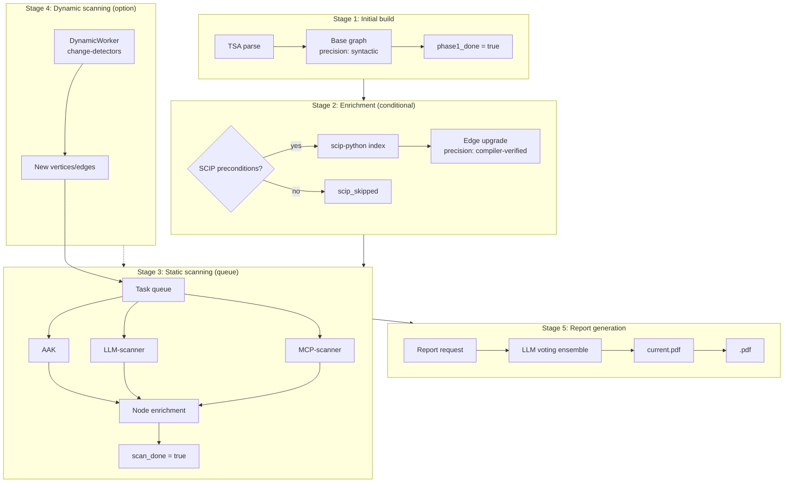

# ADR-0003: Graph Formation Cycle

**Status:** Proposed
**Date:** 2026-10-09
**Context:** Phase 0 → Phase 1 → Phase 2

---

## Context

AICorellator builds the graph of AI tool interactions in five stages:

1. **AST parsing** — extraction of nodes (agent, llm_endpoint, mcp_server, tool, sink) and edges (uses_model, provides_tool, delegates_to, has_access_to) from source code and configs.
2. **Enrichment** — refinement and supplementation of the graph through additional sources.
3. **Static scanning of instances** — running external scanners against the discovered vertices.
4. **Dynamic scanning** — detecting runtime changes and invoking static scanners when AI activity is identified.
5. **Report generation** — LLM-ensemble analysis of the graph and publication of `current.pdf`.

Key requirement: **the graph must be built fast** (TSA runs in seconds to minutes), but **enriched gradually** (SCIP requires toolchains, scanners — time). The most expensive stage must not block the pipeline.

---

## Options Considered

### Option A: Sequential pipeline

TSA → SCIP → scanners → dynamics → report. Each stage waits for the previous one to finish.

**Downside:** if SCIP is unavailable (no Node, no venv), the pipeline is blocked. If scanners run for 20 minutes, the graph is not updated for that entire time.

### Option B: Asynchronous pipeline with readiness flags

TSA → graph available. SCIP runs conditionally. Scanners — in a queue. Dynamics — separate workers.

**Advantage:** the graph is available immediately after TSA. Enrichment — as it becomes ready. Report — on request.

---

## Decision

**Adopt an asynchronous cycle with five stages and readiness flags.**

### Stage 1: Initial build (TSA)

**What:** TSA parses the source directory → base graph.

**Speed:** seconds to minutes.

**Result:** graph with nodes and edges, `precision: "syntactic"`.

**Flag:** `phase1_done = true`.

**Trigger:** immediately after completion — the fast report (`report --fast`) is available, but not mandatory.

### Stage 2: Enrichment (SCIP, conditional)

**What:** if the SCIP indexer's preconditions are met (Python 3.10+, Node 16+, activated venv) → `scip-python index .` → parse `.scip` → upgrade edges to `precision: "compiler-verified"`.

**Condition:** `scip-python` requires Node v16 or later and an activated virtual environment [^1]. If not met — SCIP is skipped, the graph stays `syntactic`.

**Speed:** minutes (full-project indexing, no incremental).

**Result:** refined edges in a side table, originals preserved.

**Flag:** `scip_done = true` (or `scip_skipped = true`).

### Stage 3: Static scanning (queue)

**What:** a task queue over the graph's vertices. Workers:

| Scanner | What it scans | What it yields |
|---|---|---|
| **AAK** | MCP servers, tools, configs | taint findings, MCP config, IPI payloads |
| **LLM-scanner** | LLM instances, configs | model, provider, endpoint |
| **MCP-scanner** | MCP servers | tool schema, capabilities |

**Asynchrony:** scanners run in parallel. Each scanner takes its vertex (or vertex type) and enriches the node.

**Counter:** `static.active_count` — drops to 0 → `scan_done = true`.

### Stage 4: Dynamic scanning (architectural option)

**What:** dynamic workers (change-detectors) — detecting runtime changes. Example: an OSSEC agent inside the container tracks file changes and sends events to the server [^2]. Or Docker diff for detecting changes in running containers [^3].

**Trigger:** when AI activity is identified (new MCP server, new tool, changed config) → invoke static scanners for the new vertices.

**Status:** the `DynamicWorker` interface exists, there are no implementations in the base version.

**Counter:** `dynamic.last_completed_at` — does not block `scan_done`, but must complete at least one cycle.

### Stage 5: Report generation

**What:** the LLM ensemble analyzes the graph → attack chains → `current.pdf`.

**Trigger:** on request only. Slow (20–30 minutes), expensive in electricity.

**Two tiers:**

- `report --fast` — after `phase1_done` (partial, no findings)
- `report --full` — after `scan_done` (complete, with findings)

**Archival:** `current.pdf` → `<timestamp>.pdf` on generating a new one.

---

## Cycle Diagram

---

## Consequences

### Positive

1. **Graph is available immediately.** TSA runs fast, `phase1_done` is set in seconds to minutes.
2. **SCIP does not block.** If there are no toolchains — the graph stays `syntactic`, the pipeline continues.
3. **Scanners are async.** Enrichment proceeds in parallel, does not block other stages.
4. **Dynamics — an option.** The interface is in place, the implementation is deferred.
5. **Report — on request.** It does not burn electricity automatically.

### Negative

1. **Coordination complexity.** Five stages, flags, counters — an orchestrator is needed.
2. **SCIP requires toolchains.** In an arbitrary container it may not run — the graph stays less precise.
3. **Dynamics not implemented.** Rug pull, dynamic tool injection — outside the visibility zone in the base version.

### Neutral

1. **`precision` as an edge attribute.** LLM analysis accounts for it: `compiler-verified` → higher chain confidence.
2. **Content hash for staleness.** Nodes with a changed hash → `confidence` is reset, a re-scan is required.

---

## Deferred

1. **DynamicWorker implementations.** File watcher, Docker diff, OSSEC integration.
2. **Incremental SCIP indices.** SCIP does not support them — full-project only.
3. **Automatic report generation.** On request only.

---

## References

[^1]: `scip-python` prerequisites — Node.js v16 or later and an activated virtual environment.
[^2]: OSSEC — an open-source HIDS; an agent inside the container can track file changes and forward events to a server.
[^3]: Docker diff — comparing container filesystem state to detect changes in running containers.

---

## Decision Made

**Graph formation cycle:**

1. **TSA** → base graph (`phase1_done`)
2. **SCIP** (conditional) → edge upgrade (`scip_done` / `scip_skipped`)
3. **Scanner queue** (AAK, LLM-scanner, MCP-scanner) → enrichment (`scan_done`)
4. **Dynamics** (option) → new vertices → queue
5. **Report** (on request) → LLM analysis → `current.pdf`

Next step: ADR-0004 on report generation.

