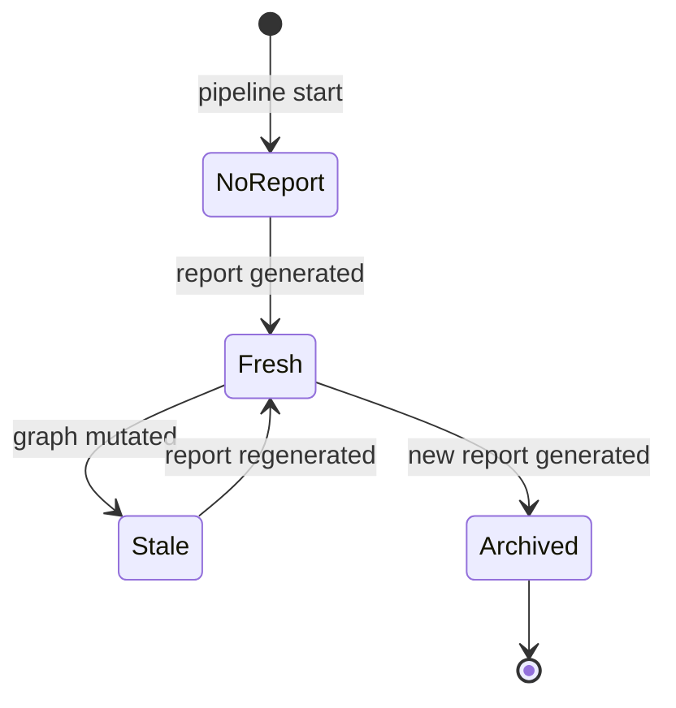
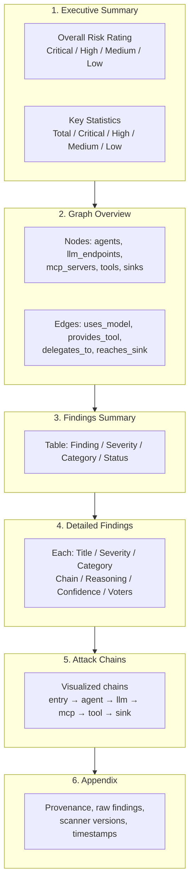

# ADR-0004: Report Generation

**Status:** Proposed
**Date:** 2026-10-09
**Context:** Phase 3 — Analysis and output

---

## Context

AICorellator builds a live graph of AI infrastructure and enriches it with scanner findings. The final step is **LLM-ensemble analysis of the graph and publication of the report** for the analyst.

Key requirements:

1. **The report is not automatic.** Generation is long (20–30 minutes for a full run with 3–4 LLMs and a judge) and expensive in resources.
2. **Two readiness tiers:** `report --fast` after `phase1_done` (base graph), `report --full` after `scan_done` (enriched graph).
3. **Archival:** `current/` → `<timestamp>/` on generating a new report.
4. **Freshness flag:** `report_fresh = false` on graph mutation.
5. **Format:** Bundle dir holding report.md, report.json, report.sarif, assets/. PDF.

---

## Options Considered

### Option A: Automatic generation on graph mutation

**Approach:** on every graph change (new node, new edge, attribute change), LLM analysis and report regeneration are triggered.

**Downsides:**

- **Expensive.** Every mutation → 20–30 minutes of LLM work. In dynamic mode the graph changes constantly.
- **Meaningless.** An analyst cannot keep up with reports generated every few minutes.
- **Resources.** The LLM ensemble burns energy continuously.

**Precedent:** AppScan has a `report` command that **loads a given scan and generates the report on request**, not automatically on every change [^1]. This is the standard pattern for heavy reports.

### Option B: On-request generation with a freshness flag

**Approach:** the report is generated only on explicit request. `report_fresh` shows whether `current/` is up to date with the current graph. On graph mutation, `report_fresh = false`, but the report is not regenerated automatically.

**Advantages:**

- **Cost control.** The analyst decides when to spend 20–30 minutes of LLM work.
- **Two tiers.** `--fast` for a quick check, `--full` for a deep audit.
- **Archival.** Each report is saved with a timestamp; the history is available.

### Option C: Hybrid — fast report automatic, full report on request

**Approach:** `report --fast` is generated automatically after `phase1_done` (fast, cheap). `report --full` — on request only.

**Advantages:**

- **Minimal latency.** The analyst sees the base report immediately.
- **Controlled full analysis.** The expensive run — at the analyst's decision.

**Downside:** even `--fast` with a single LLM can take minutes. In continuous mode it is still expensive.

---

## Decision

**Adopt the hybrid approach: `report --fast` optionally after `phase1_done`, `report --full` on request only.**

### Rationale

1. **The report is not automatic.** The requirement is pinned: generation is long and expensive. AppScan generates reports on command, not automatically [^1].
2. **Two readiness tiers.** `--fast` (after `phase1_done`) gives the base graph without findings. `--full` (after `scan_done`) gives the full analysis with findings.
3. **Timestamped archival.** `current/` → `<timestamp>/` on a new one. A timestamp in the filename — a standard pattern for reports [^2].

### Report lifecycle

| State | Condition | Action |
|---|---|---|
| `NoReport` | The report has not been generated yet | `report --fast` or `--full` available |
| `Fresh` | `report_fresh = true` | `current/` is up to date |
| `Stale` | `report_fresh = false` | The graph changed, the report is stale |
| `Archived` | A new report was generated | The old `current/` → `<timestamp>/` |

### Triggers

| Event | What happens |
|---|---|
| `phase1_done = true` | `report --fast` available (partial, no findings) |
| `scan_done = true` | `report --full` available (complete, with findings) |
| `report` request | Flag check → LLM analysis → `current/` → archive the old one |
| Graph mutation | `report_fresh = false` (the report is not generated automatically) |

### Output formats

| Format | Purpose |
|---|---|
| **Markdown** | The primary report for reading. Tables, Mermaid diagrams, chains. |
| **JSON** | Machine-readable output for integrations and CI/CD. |
| **SARIF** | For the GitHub Security tab / GitLab Security Dashboard [^3]. |

### Report structure (Markdown)

The report follows the **AI Red-Team Assessment Report** pattern [^4]:

---

## Consequences

### Positive

1. **Cost control.** The LLM ensemble runs only on request. Electricity is not burned for nothing.
2. **Two tiers.** `--fast` for a quick check, `--full` for a deep audit.
3. **Archival.** Report history is available in `<timestamp>/`.
4. **Freshness flag.** The analyst sees when `current/` is stale.

### Negative

1. **Manual trigger.** The analyst must remember to regenerate.
2. **Latency.** `--full` takes 20–30 minutes — not suitable for urgent checks.
3. **Expensive.** The LLM ensemble with a judge burns energy.

### Neutral

1. **`report_fresh` as a flag.** `false` on graph mutation, `true` after generation.
2. **Timestamp in the filename.** `<timestamp>/` — a standard pattern [^2].

---

## Deferred

1. **Automatic `--fast` generation.** Optional, if needed.
2. **Incremental reports.** Diff between two reports.
3. **Notifications.** Email/Webhook on `report_fresh = false`.

---

## References

[^1]: AppScan `report` command: loading a scan and generating the report on request
[^2]: A timestamp in the report filename — a standard versioning pattern
[^3]: SARIF output for the GitHub Security tab
[^4]: AI Red-Team Assessment Report template: report structure

---

## Decision Made

**Report generation:**

1. **`report --fast`** — after `phase1_done` (partial, base graph)
2. **`report --full`** — after `scan_done` (complete, with findings)
3. **Generation — on request only.** Automatic is not implemented.
4. **Archival:** `current/` → `<timestamp>/`
5. **Flag:** `report_fresh = false` on graph mutation
6. **Formats:** Markdown (primary), JSON, SARIF

