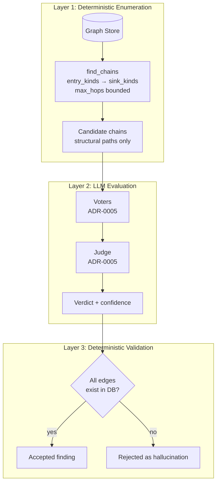

# ADR-0006: Two-Layer Chain Evaluation

**Status:** Proposed
**Date:** 2026-10-09
**Context:** Phase 3 — Analysis

---

## Context

ADR-0004 established that chain evaluation is **LLM-only** — no regex, no heuristics for evaluation. ADR-0005 defined the ensemble: voters, judge, confidence aggregation, prompt safety, storage.

But neither ADR defines **how candidate chains reach the LLM**. "The LLM receives the graph as text" works for a 50-node demo and fails for a multi-host graph with thousands of nodes. There is also an unresolved tension: the Phase 0 Query Layer already includes deterministic traversal (`get_paths`, `find_chains(entry_kinds, sink_kinds)`), yet Phase 3 claims "LLM-only."

This ADR resolves both: it defines a **two-layer design** where the deterministic layer enumerates candidates, and the LLM layer evaluates each candidate.

---

## Problem

Two failure modes emerge from the current ambiguity:

1. **Scale failure.** Serializing the entire graph into a prompt is infeasible beyond a few hundred nodes. Token budgets, chunking, and subgraph selection are undefined.
2. **Principle conflict.** If the LLM does free-form chain discovery from a giant text blob, it will hallucinate edges that do not exist. This contradicts the correctness requirement of a security report.

---

## Decision

**Adopt a two-layer design: deterministic enumeration + LLM evaluation + deterministic validation.**

### Architecture

### Layer 1: Deterministic Enumeration

**Component:** `Query Layer.find_chains(entry_kinds, sink_kinds, max_hops)`

**Responsibility:** Enumerate all structural paths from entry points to sinks, bounded by `max_hops`.

**Implementation:** SQLite recursive CTE. No LLM. No heuristics. Pure graph traversal.

**Input:**

- `entry_kinds`: `["entry_point"]`
- `sink_kinds`: `["sink"]`
- `max_hops`: configurable, default 6

**Output:** `list[CandidateChain]`, where each candidate is:

- `chain_id`: deterministic hash of the node/edge sequence
- `nodes`: ordered list of node IDs
- `edges`: ordered list of edge IDs
- `length`: number of hops

**Properties:**

- **Complete.** Every structural path within `max_hops` is enumerated. No path is missed.
- **Cheap.** SQLite recursive CTE is fast even for large graphs.
- **No evaluation.** Layer 1 only says "this path exists." It does not say "this path is exploitable."

**Key principle:** `find_chains` enumerates, it does not evaluate. The word "chains" here means "candidate chains," not "confirmed attack chains."

---

### Layer 2: LLM Evaluation

**Component:** ADR-0005 ensemble.

**Responsibility:** For each candidate chain, determine whether it is exploitable.

**Input:** Each `CandidateChain` is serialized into the prompt format defined in ADR-0005. The untrusted content (node attributes, findings, code excerpts) is wrapped in `[UNTRUSTED_DATA]` markers.

**Process:**

1. Voters receive the candidate chain and return `{exploitable, confidence, reasoning, evidence}`.
2. Confidence is aggregated (weighted mean, ADR-0005).
3. Judge (if enabled) issues the final `verdict`.

**Output:** `Finding` record with `chain_id`, `verdict`, `confidence`, `reasoning`, `voter_outputs`.

**Key principle:** The LLM evaluates, it does not discover. The candidate chain is handed to it; the LLM's job is to judge, not to search.

---

### Layer 3: Deterministic Validation

**Component:** Edge validator.

**Responsibility:** Verify that every edge in the LLM's `evidence` field exists in the `edges` table.

**Process:**

1. For each `edge_id` in `evidence`, query `edges` table.
2. If any edge is missing → the chain is rejected as a hallucination.
3. If all edges exist → the chain is accepted as a valid finding.

**Output:** `Finding.validated = true | false`.

**Key principle:** Validation is deterministic. The LLM can propose, but only the database can confirm existence. This makes hallucinated chains impossible.

---

## Why This Is Not a Contradiction

ADR-0004 says "LLM-only evaluation." This ADR says "deterministic enumeration + LLM evaluation + deterministic validation."

**The distinction is between enumeration, evaluation, and validation:**

| Activity | Layer | Why |
|---|---|---|
| **Enumeration** | Deterministic | Finding all structural paths is a graph problem, not a language problem. The LLM is not needed to enumerate. |
| **Evaluation** | LLM | Deciding whether a path is exploitable requires reasoning about semantics, context, and intent — this is what the LLM does. |
| **Validation** | Deterministic | Confirming that an edge exists is a database lookup, not a language task. |

**The principle preserved:** No regex or heuristics for *evaluation*. Enumeration and validation are not evaluation — they are structural operations.

---

## Cost Implications

| Graph size | Naive (full graph to LLM) | Two-layer |
|---|---|---|
| 50 nodes | 1 prompt, ~10k tokens | N candidates, each ~1k tokens |
| 500 nodes | Infeasible | N candidates, bounded by `max_hops` |
| 5000 nodes (multi-host) | Infeasible | N candidates, bounded by `max_hops` |

**Cost is proportional to candidate count, not graph size.** This makes cost predictable and bounded.

**Worst case:** if the graph is highly connected, candidate count can explode. Mitigation: `max_hops` bounds path length; a configurable `max_candidates` cap bounds the total number of candidates per run.

---

## Storage

**In the `chains` table:**

| Field | Type | Description |
|---|---|---|
| `chain_id` | str | Deterministic ID from Layer 1 |
| `chain_nodes` | JSON | Ordered node IDs |
| `chain_edges` | JSON | Ordered edge IDs |
| `verdict` | str | From Layer 2 (`exploitable` / `not_exploitable` / `uncertain`) |
| `confidence` | float | Aggregated from Layer 2 |
| `validated` | bool | From Layer 3 |
| `voter_outputs` | JSON | Raw voter responses (ADR-0005) |
| `prompt_version` | str | ADR-0005 |

**No candidate chains are stored.** Only evaluated chains. Candidates are transient — they exist only during the analysis run.

---

## Consequences

### Positive

1. **Scale.** Works for graphs of any size. Cost bounded by candidate count, not graph size.
2. **Correctness.** Hallucinated chains are impossible. Every reported chain is validated against the database.
3. **Principle preserved.** "No regex for evaluation" holds. Enumeration and validation are structural, not evaluative.
4. **Cost predictability.** Candidate count is known before LLM calls. Budget can be estimated.
5. **Clear separation.** `find_chains` has a precise job: enumerate. The LLM has a precise job: evaluate. The validator has a precise job: confirm.

### Negative

1. **Candidate explosion.** Highly connected graphs can produce many candidates. Mitigated by `max_hops` and `max_candidates`.
2. **Layer 1 may miss non-structural chains.** If a chain requires semantic reasoning to discover (e.g., "this agent can indirectly cause this sink via a sequence that isn't a direct path"), Layer 1 will not enumerate it. Accepted limitation: the scope is structural chains.
3. **Two components to maintain.** Query Layer and validator must stay in sync with the schema.

### Neutral

1. **`max_hops` is configurable.** Default 6. Tuned per deployment.
2. **`max_candidates` is configurable.** Default 1000. Prevents runaway.
3. **Candidate chains are transient.** Not stored. Regenerated on each run.

---

## Deferred

1. **Semantic chain discovery.** Non-structural chains (indirect causation, multi-agent propagation) are out of scope. May be addressed by a future "semantic enumerator" layer.
2. **Incremental enumeration.** Re-enumerating only changed subgraphs after graph mutation.
3. **Candidate ranking.** Prioritizing candidates by heuristic risk score before LLM evaluation, to reduce LLM calls.

---

## References

[^1]: SQLite recursive CTE — standard graph traversal mechanism
[^2]: CausalTrace — causal inference for multi-step LLM agent attacks, ICML 2026
[^3]: ChainWatch — kill chain-aligned sequential detection for MCP-based agent systems

---

## Decision

**Two-layer chain evaluation:**

1. **Layer 1 (deterministic):** `find_chains(entry_kinds, sink_kinds, max_hops)` enumerates all structural paths. SQLite recursive CTE. No LLM.
2. **Layer 2 (LLM):** Voters + judge (ADR-0005) evaluate each candidate. No regex, no heuristics.
3. **Layer 3 (deterministic):** Edge validator confirms every reported edge exists in the `edges` table. Hallucinations rejected.

**Principle:** Enumeration is structural. Evaluation is LLM. Validation is structural.