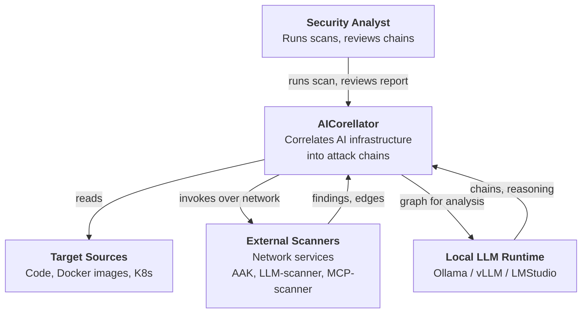

# AICorellator — C4 Level 1: System Context

**View:** System Context (C4 L1) · **Date:** 2026-10-09 · **Status:** Draft

---

## Diagram

---

## Elements

| Element | Type | Description |
|---|---|---|
| **Security Analyst** | Person | Runs AICorellator, reviews attack chains, decides which are actionable. |
| **AICorellator** | System | Builds graph of AI tool interactions, enriches vertices with findings, evaluates chains via LLM ensemble, produces reports. |
| **Local LLM Runtime** | External | Ollama or vLLM on localhost. All analysis runs locally — no external API calls. |
| **Target Sources** | External | Code repos, Docker images, K8s manifests, mounted FS. Read-only. |
| **External Scanners** | External | Network services: AAK, LLM-scanner, MCP-scanner. Invoked over network to enrich graph vertices. TSA/SCIP runs as a local subprocess and is **not** part of this external set. |

---

## Key Relationships

| From | To | Description |
|---|---|---|
| Security Analyst | AICorellator | Runs scans, reviews reports |
| AICorellator | Target Sources | Reads code, configs, container layers |
| AICorellator | External Scanners | Invokes scanners over network |
| External Scanners | AICorellator | Return findings, enrich nodes |
| AICorellator | Local LLM Runtime | Sends graph for analysis |
| Local LLM Runtime | AICorellator | Returns chains, reasoning, confidence |

---

## What Is NOT Shown

- **Internal structure of AICorellator** — that is C4 L2 (Containers).
- **Internal structure of Local LLM Runtime** — external system, out of scope.
- **Internal structure of External Scanners** — separate view.
- **Deployment topology** — separate view (C4 Deployment).
- **Data flows within the system** — C4 L2/L3.

---

## Boundary

AICorellator owns the **graph**, the **analysis pipeline**, and the **report**. It does not own the LLM, the scanners, or the sources — it orchestrates them.

No external API calls (OpenAI, Anthropic). All LLM analysis runs locally.

External scanners are **network services** — this is required because scanners are dynamic (MCP-scanner, LLM-scanner) and cannot be delivered as local subprocesses. TSA/SCIP is the only exception: it runs as a local subprocess because it must operate on the target's filesystem directly.

---

## Next

- **C4 L2 (Container):** internal modules of AICorellator.
- **C4 L3 (Component):** internal structure of each module.
- **C4 Deployment:** multi-host topology (Core + Agent).