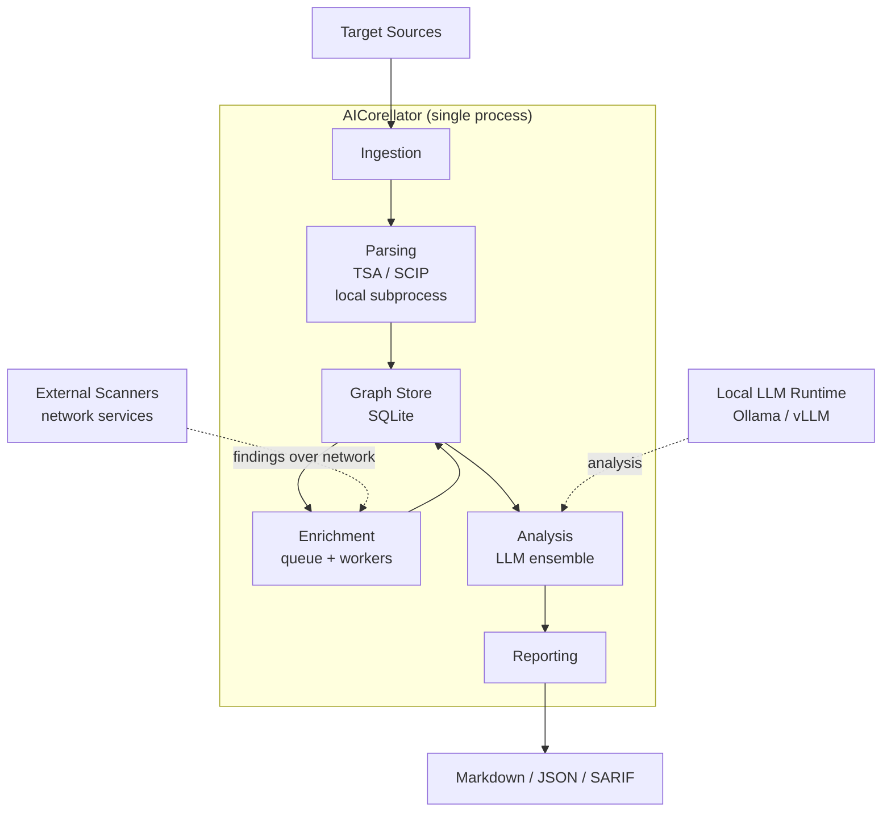

# AICorellator — C4 Level 2: Containers

**View:** Container (C4 L2) · **Date:** 2026-10-09 · **Status:** Draft

---

## Diagram

---

## Containers

| Container | Responsibility | Technology |
|---|---|---|
| **Ingestion** | Accepts target sources: folder, repo, unpacked image, mounted FS. Normalizes input paths. | Python |
| **Parsing** | Runs TSA (always) and SCIP (conditionally). Produces nodes and edges. Local subprocess — must access target filesystem directly. | TSA, SCIP, Python |
| **Graph Store** | Single source of truth. Live, mutable graph: nodes, edges, findings, hosts, state, task_state. | SQLite |
| **Enrichment** | Task queue. Static workers (AAK, LLM-scanner, MCP-scanner) and dynamic workers (change-detectors). Enriches vertices with findings. | Python asyncio + network clients |
| **Analysis** | LLM voting ensemble. Serializes graph to text, sends to local LLM, parses chains + reasoning + confidence. | Python + Ollama/vLLM client |
| **Reporting** | Generates Markdown / JSON / SARIF. Manages `current.pdf` → `<timestamp>.pdf` archival. | Python |

---

## Relationships

| From | To | Description |
|---|---|---|
| Target Sources | Ingestion | Read-only access to code, configs, container layers |
| Ingestion | Parsing | Normalized path handed to parser |
| Parsing | Graph Store | Writes nodes and edges |
| Graph Store | Enrichment | Provides vertices for scanning |
| Enrichment | Graph Store | Writes findings and attributes back |
| Graph Store | Analysis | Provides enriched graph |
| Analysis | Reporting | Provides chains + reasoning |
| External Scanners | Enrichment | Findings over network |
| Local LLM Runtime | Analysis | Chain evaluation |

---

## Notes

- **Single process.** All internal containers are modules of one Python process. No Docker containers, no microservices.
- **TSA/SCIP is local.** Parsing requires direct filesystem access, so it runs as a subprocess, not a network service.
- **External scanners are network-only.** MCP-scanner and LLM-scanner are dynamic and cannot be delivered as local subprocesses.
- **Graph Store is the only stateful container.** Everything else is stateless or derives state from the graph.

---

## Next

- **C4 L3 (Component):** internal structure of Parsing, Enrichment, Analysis, Reporting.
- **C4 Deployment:** multi-host topology (Core + Agent).