# AICorellator — C4 Level 3: Components (Phase 0)

**View:** Component (C4 L3) · **Phase:** 0 — Data Model · **Date:** 2026-10-09 · **Status:** Draft

---

## Scope

Phase 0 covers only the **data model**: SQLite schema and the Python API over it. No parsing, no enrichment, no analysis, no reporting. The L3 diagram shows the internal structure of a single container from L2 — **Graph Store** — plus the interfaces it exposes to the future phases.

---

## Diagram

```mermaid
flowchart TB
    subgraph GS["Graph Store (SQLite)"]
        SCHEMA[Schema<br/>DDL + migrations]
        NODES[Nodes Repository]
        EDGES[Edges Repository]
        FINDINGS[Findings Repository<br/>scanner findings]
        CHAINS[Chains Repository<br/>evaluated chains]
        HOSTS[Hosts Repository]
        STATE[State Repository<br/>per-host]
        TASKS[Task State Repository]
        REPORTS[Reports Repository<br/>bundle dirs]
        QUERY[Query Layer]
        TRIGGERS[Triggers]
    end

    FUTURE1[Parsing<br/>Phase 1] -.->|writes nodes + edges| NODES
    FUTURE1 -.->|writes nodes + edges| EDGES
    FUTURE2[Enrichment<br/>Phase 2] -.->|reads vertices| QUERY
    FUTURE2 -.->|writes scanner findings| FINDINGS
    FUTURE2 -.->|updates counters| TASKS
    FUTURE3[Analysis<br/>Phase 3] -.->|reads enriched graph| QUERY
    FUTURE3 -.->|reads findings| FINDINGS
    FUTURE3 -.->|writes evaluated chains| CHAINS
    FUTURE4[Reporting<br/>Phase 3] -.->|reads flags| STATE
    FUTURE4 -.->|reads chains| CHAINS
    FUTURE4 -.->|writes report metadata| REPORTS
    FUTURE5[Agent registration<br/>Phase 3] -.->|writes hosts| HOSTS
```



---

## Components

### 1. Schema (DDL + migrations)

**Responsibility:** Defines the SQLite structure. Applied at startup with `PRAGMA foreign_keys = ON`, `PRAGMA journal_mode = WAL`. Migration policy: forward-only, numbered SQL files.

**Artifacts:** `docs/schema.sql`, `docs/migrations/NNN_description.sql`, `schema_version` table.

**Tables:** `nodes`, `edges`, `findings`, `chains`, `hosts`, `state`, `task_state`, `reports`, `schema_version`.

**Constraints:** `CHECK` on `kind` (node and edge enums), `CHECK` on `confidence` range `[0.0, 1.0]`, `CHECK` on `severity` enum, `CHECK` on `status` enum, `CHECK` on `verdict` enum.

**Migration policy:** forward-only. At startup, compare `MAX(schema_version.version)` against code's expected version. If less — apply missing migrations. If greater — refuse to start.

---

### 2. Nodes Repository

**Responsibility:** CRUD over the `nodes` table.

**Interface:**

- `add_node(node: Node) -> None`
- `get_node(node_id: str) -> Node | None`
- `update_node_attr(node_id: str, key: str, value: Any) -> None`
- `update_node_confidence(node_id: str, delta: float) -> None`
- `mark_stale(node_id: str) -> None`
- `list_nodes(kind: str | None = None, host_id: str | None = None) -> list[Node]`

**Key fields:** `id`, `kind`, `name`, `host_id`, `attributes` (JSON), `confidence` (REAL), `content_hash`, `status`, `created_at`, `updated_at`.

**Canonical ID derivation:**

```
node_id = sha256(kind + name + host_id)
```

`host_id` is part of the canonical ID. Two hosts producing a node with the same `kind` and `name` yield **different** node IDs. This is required for multi-host: `ollama:11434` on host A and on host B are distinct nodes with distinct reachability.

**Content hash:** `sha256(file_content)` of the source artifact. Used for re-run caching — unchanged hash → findings reused.

---

### 3. Edges Repository

**Responsibility:** CRUD over the `edges` table. Enforces uniqueness on `(source_id, target_id, kind, host_id)`.

**Interface:**

- `add_edge(edge: Edge) -> None`
- `get_edge(edge_id: str) -> Edge | None`
- `list_edges(source_id: str | None = None, target_id: str | None = None, kind: str | None = None) -> list[Edge]`
- `mark_stale(edge_id: str) -> None`

**Key fields:** `id`, `source_id`, `target_id`, `kind`, `host_id`, `attributes`, `confidence`, `status`, `created_at`, `updated_at`.

**Edge kinds (stored):** `uses_model`, `provides_tool`, `delegates_to`, `has_access_to`.

**Edge kinds (derived, not stored):**

- `reaches_sink` — computed by Query Layer as a path ending in `has_access_to` to a sink node.
- `called_by` — computed by Query Layer as the reverse of `uses_model`, `provides_tool`, `delegates_to`.

**Cascade:** `ON DELETE CASCADE` from `nodes` — removing a node removes its edges.

---

### 4. Findings Repository

**Responsibility:** CRUD over the `findings` table. A finding is a **weakness reported by a scanner**, attached to either a node or an edge.

**Interface:**

- `add_finding(finding: Finding) -> None`
- `list_findings(node_id: str | None = None, edge_id: str | None = None, severity: str | None = None) -> list[Finding]`
- `mark_stale(finding_id: str) -> None`

**Key fields:** `id`, `node_id`, `edge_id`, `scanner`, `rule_id`, `severity`, `title`, `description`, `evidence` (JSON), `confidence`, `status`, `created_at`.

**Constraint:** `node_id IS NOT NULL OR edge_id IS NOT NULL` — a finding must attach to something.

**Provenance:** `scanner` identifies the source (`aak`, `llm-scanner`, `mcp-scanner`). `rule_id` is the scanner-specific rule (e.g., `AAK-LLM-SQL-RCE-001`).

**Relationship to `chains`:** findings are **inputs** to chain evaluation. A chain's reasoning may cite findings, but findings are not chains.

---

### 5. Chains Repository

**Responsibility:** CRUD over the `chains` table. A chain is an **evaluated compromise chain** produced by the correlator (ADR-0005, ADR-0006).

**Interface:**

- `add_chain(chain: Chain) -> None`
- `get_chain(chain_id: str) -> Chain | None`
- `list_chains(verdict: str | None = None, min_confidence: float | None = None) -> list[Chain]`
- `mark_stale(chain_id: str) -> None`

**Key fields:**

| Field | Type | Description |
|---|---|---|
| `id` | str | Deterministic chain_id from Layer 1 (ADR-0006) |
| `chain_nodes` | JSON | Ordered node IDs |
| `chain_edges` | JSON | Ordered edge IDs |
| `verdict` | str | `exploitable` / `not_exploitable` / `uncertain` |
| `confidence` | float | Aggregated (ADR-0005) |
| `reasoning` | str | Judge reasoning or aggregated voters' reasoning |
| `voter_outputs` | JSON | Raw voter responses (ADR-0005) |
| `prompt_version` | str | Prompt version used (ADR-0005) |
| `validated` | bool | Layer 3 validation result (ADR-0006) |
| `status` | str | `active` / `stale` |
| `created_at` | timestamp | |

**Constraint:** `CHECK` on `verdict` (`exploitable` / `not_exploitable` / `uncertain`), `CHECK` on `confidence` range `[0.0, 1.0]`.

**Validation flag:** `validated = false` means the chain was rejected as a hallucination (ADR-0006 Layer 3). Such chains are stored but not surfaced in reports.

**Candidate chains are NOT stored.** Only evaluated chains. Candidates are transient — they exist only during the analysis run.

---

### 6. Hosts Repository

**Responsibility:** CRUD over the `hosts` table. In Phase 0 there is always one row: `localhost`.

**Interface:**

- `register_host(host: Host) -> None`
- `get_host(host_id: str) -> Host | None`
- `update_heartbeat(host_id: str) -> None`
- `list_hosts(status: str | None = None) -> list[Host]`

**Key fields:** `id`, `hostname`, `ip`, `platform`, `agent_version`, `last_heartbeat`, `status`, `created_at`.

**Phase 0 bootstrap:** on first startup, insert `localhost` with `platform = 'standalone'`.

**Phase 3 note:** Agent registration writes here.

---

### 7. State Repository (per-host)

**Responsibility:** Key-value flags for pipeline lifecycle, **scoped per host**.

**Interface:**

- `get_flag(host_id: str, key: str) -> str | None`
- `set_flag(host_id: str, key: str, value: str) -> None`
- `list_flags(host_id: str) -> dict[str, str]`
- `get_global_flag(key: str) -> str | None` — derived: returns `true` if all hosts have `key = true`

**Primary key:** `(host_id, key)`.

**Expected keys per host:** `phase1_done`, `scan_done`, `report_fresh`, `last_report_at`, `dynamic_enabled`.

**Global derivation:** `get_global_flag("scan_done")` returns `true` only if **every** active host has `scan_done = true`. This is a query, not a stored value.

**Rationale:** in multi-host, `scan_done` on host A does not mean `scan_done` on host B. A global flag derived from per-host flags is the only consistent model.

---

### 8. Task State Repository

**Responsibility:** Counters for the enrichment queue. Two rows per host, one per worker kind.

**Interface:**

- `increment(host_id: str, kind: str) -> None`
- `decrement(host_id: str, kind: str) -> None`
- `get_counter(host_id: str, kind: str) -> TaskCounter`
- `mark_cycle_complete(host_id: str, kind: str) -> None`

**Primary key:** `(host_id, kind)`.

**Rows:** `static`, `dynamic` — per host.

**Fields:** `host_id`, `kind`, `active_count`, `last_completed_at`, `updated_at`.

**Failure semantics** (ADR pending): `scan_done` is defined as "all tasks in terminal state (done | failed | timeout)", not "active_count = 0". This is a Phase 2 concern, but the schema must support it — hence a terminal-state counter is added in Phase 2.

---

### 9. Reports Repository

**Responsibility:** Metadata about generated reports. The report itself is a **bundle directory** on disk.

**Interface:**

- `add_report(report: Report) -> None`
- `get_current_report(host_id: str) -> Report | None`
- `archive_current(host_id: str, timestamp: str) -> None`
- `list_reports(host_id: str) -> list[Report]`

**Key fields:** `id`, `host_id`, `bundle_dir`, `tier` (`fast` | `full`), `is_current`, `generated_at`, `metadata` (JSON).

**Bundle structure:**

```
current/
├── report.md
├── report.json
├── report.sarif
└── assets/
```

**Archival:** on new report generation, `current/` → `<timestamp>/`, new `current/` created. `is_current` flag moves to the new row.

**Constraint:** partial unique index on `(host_id, is_current = 1)` — only one current report per host.

---

### 10. Query Layer

**Responsibility:** Read-only queries that span repositories. Used by Analysis (Phase 3) to enumerate candidates and serialize graph slices.

**Interface:**

- `get_neighbors(node_id: str, depth: int = 1) -> GraphSlice`
- `get_paths(source_kind: str, target_kind: str, max_hops: int = 6) -> list[Path]`
- `get_subgraph(kinds: list[str], edge_kinds: list[str]) -> GraphSlice`
- `find_chains(entry_kinds: list[str], sink_kinds: list[str], max_hops: int = 6, max_candidates: int = 1000) -> list[CandidateChain]`
- `validate_edges(edge_ids: list[str]) -> list[str]` — returns edge IDs that exist in the DB

**`find_chains` semantics (ADR-0006):**

- **Enumerates** structural paths. Does not evaluate.
- **Bounded** by `max_hops` and `max_candidates`.
- **Implementation:** SQLite recursive CTE.
- **Returns:** `CandidateChain` with `chain_id`, `nodes`, `edges`, `length`.

**`validate_edges` semantics (ADR-0006 Layer 3):**

- Takes a list of edge IDs from an LLM's `evidence` field.
- Returns only those that exist in the `edges` table.
- Used to reject hallucinated chains.

**Derived edges:** `reaches_sink` and `called_by` are computed here, not stored.

---

### 11. Triggers

**Responsibility:** Keep `updated_at` fresh on `nodes` and `edges` after any `UPDATE`.

**Artifacts:** `trg_nodes_updated_at`, `trg_edges_updated_at`.

---

## Cleanup Policy

**Responsibility:** Prevent unbounded growth of the single SQLite file across re-runs.

**Parameters (stored in `state`, per host or global):**

| Key | Default | Meaning |
|---|---|---|
| `cleanup_stale_days` | 30 | Delete nodes with `status = 'stale'` older than N days |
| `cleanup_findings_days` | 90 | Delete findings with `status = 'stale'` older than N days |
| `cleanup_chains_days` | 90 | Delete chains with `status = 'stale'` older than N days |
| `cleanup_reports_days` | 365 | Delete report bundle dirs older than N days (metadata kept) |

**Execution:** at startup, after migrations. Runs in a transaction. Cascade deletes handle edges and findings attached to removed nodes.

**Rationale:** the graph is "alive, mutable, no versioning" — but "no versioning" does not mean "no cleanup". Stale nodes that have been gone for a month are unlikely to be relevant.

---

## Interfaces to Future Phases

| Phase | Component | Reads | Writes |
|---|---|---|---|
| 1 | Parsing | — | `nodes`, `edges` |
| 2 | Enrichment | `nodes`, `edges` (vertices) | `findings`, `nodes.attributes`, `task_state` |
| 3 | Analysis | `nodes`, `edges`, `findings` (enriched graph) | `chains` |
| 3 | Reporting | `state`, `chains`, `findings`, `nodes` | `reports`, `state` |
| 3 | Agent registration | — | `hosts` |

---

## What Is NOT Shown

- **Parsing internals** — Phase 1 component view.
- **Enrichment internals** — Phase 2 component view (queue, workers, network clients).
- **Analysis internals** — Phase 3 component view (LLM client, voting, parsing).
- **Reporting internals** — Phase 3 component view (Markdown/JSON/SARIF generators).
- **Multi-host sync protocol** — Phase 3 open question.

---

## Design Notes

1. **Single stateful component.** Everything else derives state from SQLite. No in-memory caches in Phase 0.
2. **Repositories are thin.** Each is a Python class wrapping a set of prepared statements. No ORM — SQLite driver only.
3. **Query Layer is the only cross-repository reader.** Direct SQL in Analysis and Reporting is forbidden; they go through Query Layer.
4. **`confidence` is a float, not a boolean.** Staleness is gradual. `mark_stale` is a convenience for hard invalidation, but the primary mechanism is `update_node_confidence` with a delta.
5. **`content_hash` on nodes enables re-run caching.** Unchanged node → findings reused. Changed node → findings invalidated.
6. **Findings and chains are separate tables.** Findings are scanner-reported weaknesses. Chains are correlator-evaluated compromise paths. This naming distinction is deliberate — mixing them was an error caught in review.
7. **Canonical IDs include `host_id`.** Required for multi-host. Two hosts with identical code produce distinct nodes.
8. **State is per-host.** Global flags are derived by query, not stored.
9. **Reports are bundle dirs.** Not single files. `report.md`, `report.json`, `report.sarif`, `assets/`.
10. **Migration policy is forward-only.** No downgrade. Version mismatch → refuse to start.

---
