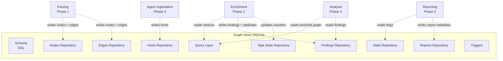

# AICorellator — C4 Level 3: Components (Phase 0)

**View:** Component (C4 L3) · **Phase:** 0 — Data Model · **Date:** 2026-10-09 · **Status:** Draft

---

## Scope

Phase 0 covers only the **data model**: SQLite schema and the Python API over it. No parsing, no enrichment, no analysis, no reporting. The L3 diagram for Phase 0 shows the internal structure of a single container from L2 — **Graph Store** — plus the interfaces it exposes to the future phases.

---

## Diagram

---

## Components

### 1. Schema (DDL)

**Responsibility:** Defines the SQLite structure. Applied once at startup (`PRAGMA foreign_keys = ON`, `PRAGMA journal_mode = WAL`).

**Artifacts:** `docs/schema.sql`

**Tables:** `nodes`, `edges`, `findings`, `hosts`, `state`, `task_state`, `reports`.

**Constraints:** `CHECK` on `kind` (node and edge enums), `CHECK` on `confidence` range `[0.0, 1.0]`, `CHECK` on `severity` enum, `CHECK` on `status` enum.

---

### 2. Nodes Repository

**Responsibility:** CRUD over the `nodes` table.

**Interface:**

- `add_node(node: Node) -> None`
- `get_node(node_id: str) -> Node | None`
- `update_node_attr(node_id: str, key: str, value: Any) -> None`
- `update_node_confidence(node_id: str, delta: float) -> None`
- `mark_stale(node_id: str) -> None`
- `list_nodes(kind: str | None = None, host_id: str | None = None) -> list[Node]`

**Key fields:** `id` (canonical), `kind`, `name`, `host_id`, `attributes` (JSON), `confidence` (REAL), `content_hash`, `status`, `created_at`, `updated_at`.

---

### 3. Edges Repository

**Responsibility:** CRUD over the `edges` table. Enforces uniqueness on `(source_id, target_id, kind, host_id)`.

**Interface:**

- `add_edge(edge: Edge) -> None`
- `get_edge(edge_id: str) -> Edge | None`
- `list_edges(source_id: str | None = None, target_id: str | None = None, kind: str | None = None) -> list[Edge]`
- `mark_stale(edge_id: str) -> None`

**Key fields:** `id`, `source_id`, `target_id`, `kind`, `host_id`, `attributes`, `confidence`, `status`, `created_at`, `updated_at`.

**Cascade:** `ON DELETE CASCADE` from `nodes` — removing a node removes its edges.

---

### 4. Findings Repository

**Responsibility:** CRUD over the `findings` table. Findings attach to either a node or an edge (exclusive `CHECK`).

**Interface:**

- `add_finding(finding: Finding) -> None`
- `list_findings(node_id: str | None = None, edge_id: str | None = None, severity: str | None = None) -> list[Finding]`
- `mark_stale(finding_id: str) -> None`

**Key fields:** `id`, `node_id`, `edge_id`, `scanner`, `rule_id`, `severity`, `title`, `description`, `evidence` (JSON), `confidence`, `status`, `created_at`.

**Constraint:** `node_id IS NOT NULL OR edge_id IS NOT NULL`.

---

### 5. Hosts Repository

**Responsibility:** CRUD over the `hosts` table. In Phase 0 there is always one row: `localhost`.

**Interface:**

- `register_host(host: Host) -> None`
- `get_host(host_id: str) -> Host | None`
- `update_heartbeat(host_id: str) -> None`
- `list_hosts(status: str | None = None) -> list[Host]`

**Key fields:** `id`, `hostname`, `ip`, `platform`, `agent_version`, `last_heartbeat`, `status`, `created_at`.

**Phase 3 note:** Agent registration writes here.

---

### 6. State Repository

**Responsibility:** Key-value flags for pipeline lifecycle.

**Interface:**

- `get_flag(key: str) -> str | None`
- `set_flag(key: str, value: str) -> None`
- `list_flags() -> dict[str, str]`

**Expected keys:** `phase1_done`, `scan_done`, `report_fresh`, `last_report_at`, `dynamic_enabled`.

---

### 7. Task State Repository

**Responsibility:** Counters for the enrichment queue. Two rows, one per worker kind.

**Interface:**

- `increment(kind: str) -> None`
- `decrement(kind: str) -> None`
- `get_counter(kind: str) -> TaskCounter`
- `mark_cycle_complete(kind: str) -> None`

**Rows:** `static`, `dynamic`. Fields: `kind`, `active_count`, `last_completed_at`, `updated_at`.

---

### 8. Reports Repository

**Responsibility:** Metadata about generated reports. The report file itself lives on disk (`current.pdf`, `<timestamp>.pdf`).

**Interface:**

- `add_report(report: Report) -> None`
- `get_current_report() -> Report | None`
- `archive_current(timestamp: str) -> None`
- `list_reports() -> list[Report]`

**Key fields:** `id`, `path`, `tier` (`fast` | `full`), `is_current`, `generated_at`, `metadata` (JSON).

**Constraint:** partial unique index on `is_current = 1` — only one current report at a time.

---

### 9. Query Layer

**Responsibility:** Read-only queries that span repositories. Used by Analysis (Phase 3) to serialize graph slices.

**Interface:**

- `get_neighbors(node_id: str, depth: int = 1) -> GraphSlice`
- `get_paths(source_kind: str, target_kind: str, max_hops: int = 6) -> list[Path]`
- `get_subgraph(kinds: list[str], edge_kinds: list[str]) -> GraphSlice`
- `find_chains(entry_kinds: list[str], sink_kinds: list[str]) -> list[Chain]`

**Returns:** `GraphSlice` — nodes + edges + findings, ready for serialization to text for the LLM.

---

### 10. Triggers

**Responsibility:** Keep `updated_at` fresh on `nodes` and `edges` after any `UPDATE`.

**Artifacts:** `trg_nodes_updated_at`, `trg_edges_updated_at`.

---

## Interfaces to Future Phases

| Phase | Component | Reads | Writes |
|---|---|---|---|
| 1 | Parsing | — | `nodes`, `edges` |
| 2 | Enrichment | `nodes`, `edges` (vertices) | `findings`, `nodes.attributes`, `task_state` |
| 3 | Analysis | `nodes`, `edges`, `findings` (enriched graph) | — |
| 3 | Reporting | `state`, `findings`, `nodes` | `reports`, `state` |
| 3 | Agent registration | — | `hosts` |

---

## What Is NOT Shown

- **Parsing internals** — Phase 1 component view.
- **Enrichment internals** — Phase 2 component view (queue, workers, network clients).
- **Analysis internals** — Phase 3 component view (LLM client, voting, parsing).
- **Reporting internals** — Phase 3 component view (Markdown/JSON/SARIF generators).

---

## Design Notes

1. **Single stateful component.** Everything else derives state from SQLite. No in-memory caches in Phase 0.
2. **Repositories are thin.** Each is a Python class wrapping a set of prepared statements. No ORM — SQLite driver only.
3. **Query Layer is the only cross-repository reader.** Direct SQL in Analysis and Reporting is forbidden; they go through Query Layer.
4. **`confidence` is a float, not a boolean.** Staleness is gradual. `mark_stale` is a convenience for hard invalidation, but the primary mechanism is `update_node_confidence` with a delta.
5. **`content_hash` on nodes enables re-run caching.** Unchanged node → findings reused. Changed node → findings invalidated.

---

## Next

- **Phase 1 L3:** Parsing (TSA/SCIP invocation, normalization).
- **Phase 2 L3:** Enrichment (queue, workers, network clients).
- **Phase 3 L3:** Analysis, Reporting.
- **C4 Deployment:** Core + Agent topology.