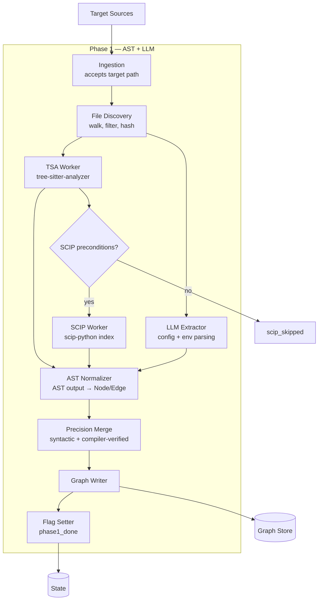

# AICorellator — C4 Level 3: Components (Phase 1)

**View:** Component (C4 L3) · **Phase:** 1 — AST + LLM · **Date:** 2026-10-09 · **Status:** Draft

---

## Scope

Phase 1 covers **graph population from source code and configs**. It takes a target directory, runs an AST parser (TSA always, SCIP conditionally), and writes nodes and edges into the Graph Store. It also runs an LLM extractor that reads config files (`config.py`, `.env`, `docker-compose.yml`) and produces `llm_endpoint` nodes plus `uses_model` edges.

No enrichment (Phase 2). No analysis (Phase 3). No reporting (Phase 3).

---

## Diagram

---

## Components

### 1. Ingestion

**Responsibility:** Accepts a target path — folder, repo root, unpacked image, or mounted FS. Normalizes it into an absolute root path. Validates that the path exists and is readable.

**Interface:**

- `ingest(path: str) -> Target`
- `Target.root: str`
- `Target.kind: str` — `folder` | `repo` | `image` | `mount`

**Phase 1 note:** Only `folder`, `repo`, and `mount` are supported. Image unpacking is a Phase 3 Agent responsibility.

---

### 2. File Discovery

**Responsibility:** Walks the target tree, applies include/exclude rules, computes a content hash per file. Produces a manifest of files to parse.

**Interface:**

- `discover(target: Target) -> FileManifest`
- `FileManifest.files: list[FileEntry]`
- `FileEntry.path: str`
- `FileEntry.language: str | None`
- `FileEntry.content_hash: str`

**Exclude rules:** `.git/`, `node_modules/`, `__pycache__/`, `venv/`, `.venv/`, `dist/`, `build/`, `*.pyc`.

**Language detection:** by extension. Languages supported by TSA: Python, Java, JS/TS, Go, Rust, C, C++, C#, Swift, Kotlin, Ruby, PHP.

---

### 3. TSA Worker

**Responsibility:** Runs `tree-sitter-analyzer` on the target tree. Produces a language-agnostic index of symbols and call edges.

**Interface:**

- `run(target: Target) -> TSAOutput`
- `TSAOutput.symbols: list[Symbol]`
- `TSAOutput.call_edges: list[CallEdge]`
- `TSAOutput.precision: "syntactic"`

**Invocation:** `uvx --from tree-sitter-analyzer` as a local subprocess. No venv, no Node, no compiler required.

**Output format:** JSON (TSA's structured output). Mermaid export available but not used here.

**Always runs.** This is the baseline. If TSA fails, Phase 1 fails.

---

### 4. SCIP Worker (conditional)

**Responsibility:** Runs the appropriate SCIP indexer for the detected language. Produces compiler-verified cross-file references.

**Interface:**

- `check_preconditions(language: str) -> SCIPCheck`
- `run(target: Target, language: str) -> SCIPOutput`
- `SCIPOutput.references: list[Reference]`
- `SCIPOutput.precision: "compiler-verified"`

**Preconditions by language:**

| Language | Indexer | Preconditions |
|---|---|---|
| Python | `scip-python` | Python 3.10+, Node 16+, activated venv |
| TypeScript/JS | `scip-typescript` | Node 16+ |
| Go | `scip-go` | Go toolchain |
| Java | `scip-java` | Gradle/Maven |
| Rust | `rust-analyzer` | Rust toolchain |
| C/C++ | `scip-clang` | `compile_commands.json` |

**Conditional.** If preconditions fail → `scip_skipped = true`, graph stays `syntactic`.

**Invocation:** local subprocess. Full-project indexing only — no incremental.

---

### 5. LLM Extractor

**Responsibility:** Reads config files and extracts LLM endpoint information. This is the component that closes the "agent → model" gap that AAK and agent-bom cannot close.

**Interface:**

- `extract(target: Target) -> LLMOutput`
- `LLMOutput.endpoints: list[LLMEndpoint]`
- `LLMEndpoint.provider: str`
- `LLMEndpoint.model: str`
- `LLMEndpoint.base_url: str | None`
- `LLMEndpoint.source_file: str`
- `LLMEndpoint.source_line: int`

**Files scanned:**

| Pattern | What is extracted |
|---|---|
| `config.py`, `settings.py`, `config/*.py` | `LLM_PROVIDER`, `LLM_DEFAULT_MODEL`, `OLLAMA_BASE_URL`, `OPENAI_API_KEY` (existence only) |
| `.env`, `.env.*` | same keys |
| `docker-compose.yml`, `docker-compose.*.yml` | service env vars |
| `pyproject.toml`, `uv.lock` | LLM-related dependencies (`openai`, `anthropic`, `ollama`, `litellm`, `vllm`) |
| `*.yaml`, `*.json`, `*.toml` | any of the above keys |

**Detection patterns (regex + AST):**

- Env var names: `LLM_PROVIDER`, `LLM_DEFAULT_MODEL`, `LLM_MODEL`, `*_MODEL`, `*_MODEL_NAME`, `*_API_BASE`, `*_BASE_URL`, `*_ENDPOINT`, `OPENAI_*`, `ANTHROPIC_*`, `OLLAMA_*`, `VLLM_*`, `LITELLM_*`
- Python calls: `ChatOpenAI(`, `OpenAI(`, `Anthropic(`, `ollama.chat(`, `litellm.completion(`

**LLM-related dependencies:** scanned from lock files. Emits `llm_endpoint` nodes only if a provider/model is identifiable.

---

### 6. AST Normalizer

**Responsibility:** Converts TSA output, SCIP output, and LLM output into the internal `Node` / `Edge` model. Applies heuristics to classify symbols into node kinds.

**Interface:**

- `normalize(tsa: TSAOutput, scip: SCIPOutput | None, llm: LLMOutput) -> GraphDelta`
- `GraphDelta.nodes: list[Node]`
- `GraphDelta.edges: list[Edge]`

**Classification heuristics:**

| Signal | Node kind |
|---|---|
| File path matches `agents/**`, `*/agent*.py`, class name ends with `Agent` | `agent` |
| Symbol from LLM Extractor | `llm_endpoint` |
| File path matches `mcp/servers/*/server.py`, class `FastMCP`/`Server`, decorator `@mcp.tool` | `mcp_server` |
| Function with decorator `@tool` / `@mcp.tool` / `@server.tool` | `tool` |
| Env var or secret read in code | `credential` |
| Call to `subprocess.*`, `os.system`, `eval`, `exec`, `cursor.execute`, `open(..., 'w')` | `sink` |
| FastAPI route, Flask route, WebSocket handler | `entry_point` |

**Edge heuristics:**

| Signal | Edge kind |
|---|---|
| Agent class references LLM client or `settings.LLM_*` | `uses_model` |
| MCP server file defines tool | `provides_tool` |
| Agent calls another agent's method | `delegates_to` |
| Tool body reaches sink | `has_access_to` |
| Path from entry_point to sink via agent/tool | `reaches_sink` |
| Function call with known caller | `called_by` |

**Confidence assignment:**

- TSA-derived node: `confidence = 0.85`
- SCIP-derived node: `confidence = 0.98`
- LLM-extracted node: `confidence = 0.95`

---

### 7. Precision Merge

**Responsibility:** Merges TSA and SCIP outputs. SCIP edges **upgrade** TSA edges — they do not replace them. TSA edges are preserved in a side table with `precision: "syntactic"`; SCIP edges are added with `precision: "compiler-verified"`.

**Interface:**

- `merge(tsa_edges: list[Edge], scip_edges: list[Edge]) -> list[Edge]`

**Rules:**

- If an edge exists in both TSA and SCIP (same source, target, kind) → keep SCIP, mark as `compiler-verified`.
- If an edge exists only in TSA → keep, mark as `syntactic`.
- If an edge exists only in SCIP → add, mark as `compiler-verified`.

**No deletion.** TSA edges that SCIP did not confirm remain in the graph with `syntactic` precision.

---

### 8. Graph Writer

**Responsibility:** Writes the `GraphDelta` into the Graph Store. Deduplicates by canonical ID. Updates `content_hash` per node.

**Interface:**

- `write(delta: GraphDelta) -> None`

**Canonical ID scheme:**

- `agent:<sha256(file_path + class_name)>`
- `llm_endpoint:<sha256(provider + base_url + model)>`
- `mcp_server:<sha256(file_path)>`
- `tool:<sha256(mcp_server_id + tool_name)>`
- `credential:<sha256(source_file + var_name)>`
- `sink:<sha256(call_target + file_path)>`
- `entry_point:<sha256(file_path + route_path)>`

**Deduplication:** if a node with the same ID exists → merge attributes, keep max `confidence`.

---

### 9. Flag Setter

**Responsibility:** Sets `phase1_done = true` in the State table after a successful write.

**Interface:**

- `set_phase1_done() -> None`
- `set_scip_skipped() -> None` (if SCIP preconditions failed)

**Effect:** `report --fast` becomes available.

---

## Data Flow

| Step | Input | Output |
|---|---|---|
| Ingestion | target path | normalized `Target` |
| File Discovery | `Target` | `FileManifest` |
| TSA Worker | `FileManifest` | `TSAOutput` (symbols, call edges) |
| SCIP Worker | `FileManifest` + language | `SCIPOutput` or `scip_skipped` |
| LLM Extractor | `FileManifest` | `LLMOutput` (endpoints, models) |
| AST Normalizer | TSA + SCIP + LLM | `GraphDelta` (nodes, edges) |
| Precision Merge | TSA edges + SCIP edges | merged edges with precision |
| Graph Writer | `GraphDelta` | rows in `nodes`, `edges` |
| Flag Setter | — | `phase1_done = true` |

---

## Interfaces to Other Phases

| Direction | Component | Interface |
|---|---|---|
| Phase 1 → Phase 0 | Graph Writer | `Nodes Repository`, `Edges Repository` |
| Phase 1 → Phase 2 | Flag Setter | `state.phase1_done` |
| Phase 1 → Phase 3 | — | Graph is available for `report --fast` |

---

## What Is NOT Shown

- **Enrichment internals** — Phase 2.
- **Analysis internals** — Phase 3.
- **Reporting internals** — Phase 3.
- **Multi-host delivery** — Phase 3.
- **Agent-side scanning** — Phase 3 (Agent runs Phase 1 logic locally on each host).

---

## Design Notes

1. **TSA is the baseline.** It always runs. SCIP is an optional enrichment on top.
2. **LLM Extractor is the critical gap-closer.** AAK and agent-bom do not connect agents to models. This component does.
3. **Classification is heuristic.** No formal type analysis. Node kinds are inferred from file paths, class names, and decorators. Misclassification is possible and acceptable — the LLM analysis in Phase 3 will filter false positives.
4. **Canonical IDs are content-based.** Same code → same ID. Re-runs reuse existing nodes.
5. **`content_hash` enables re-run caching.** Unchanged file → unchanged hash → findings from Phase 2 are reused.
6. **No dynamic behavior.** Phase 1 sees only static artifacts. Dynamic tool registration, runtime endpoints, and env-based configs are invisible unless they appear in files.

---

## Next

- **Phase 2 L3:** Enrichment (queue, workers, network clients).
- **Phase 3 L3:** Analysis, Reporting.
- **C4 Deployment:** Core + Agent topology.