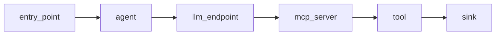
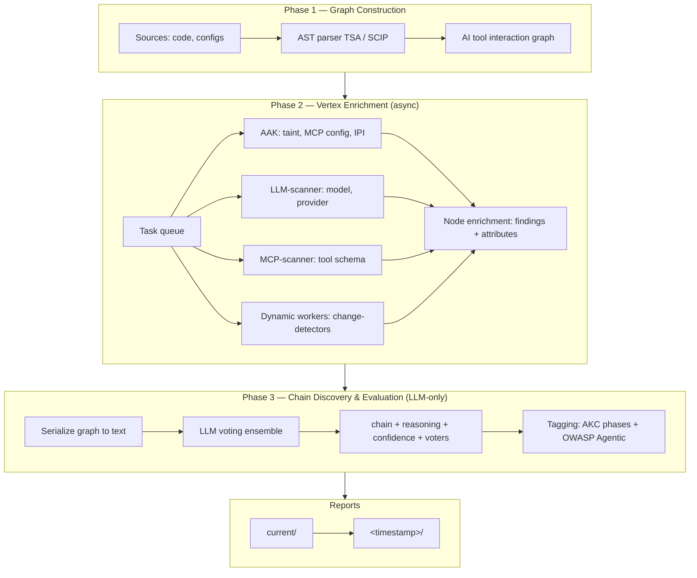
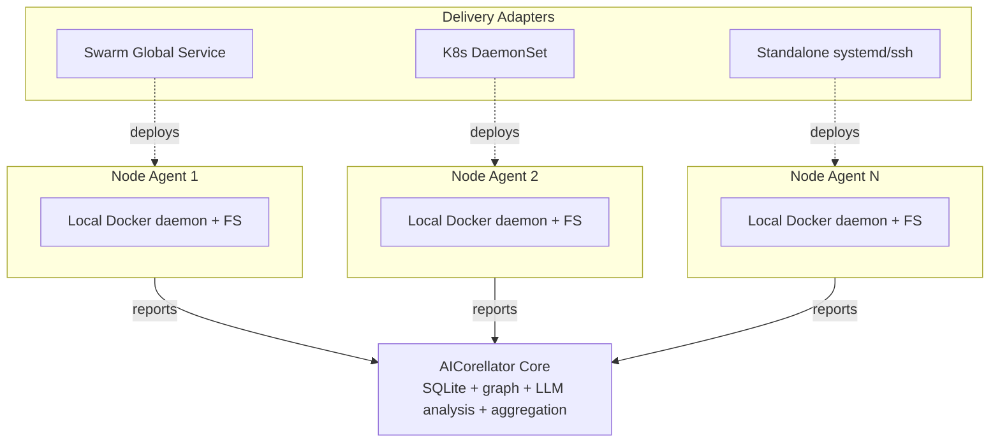
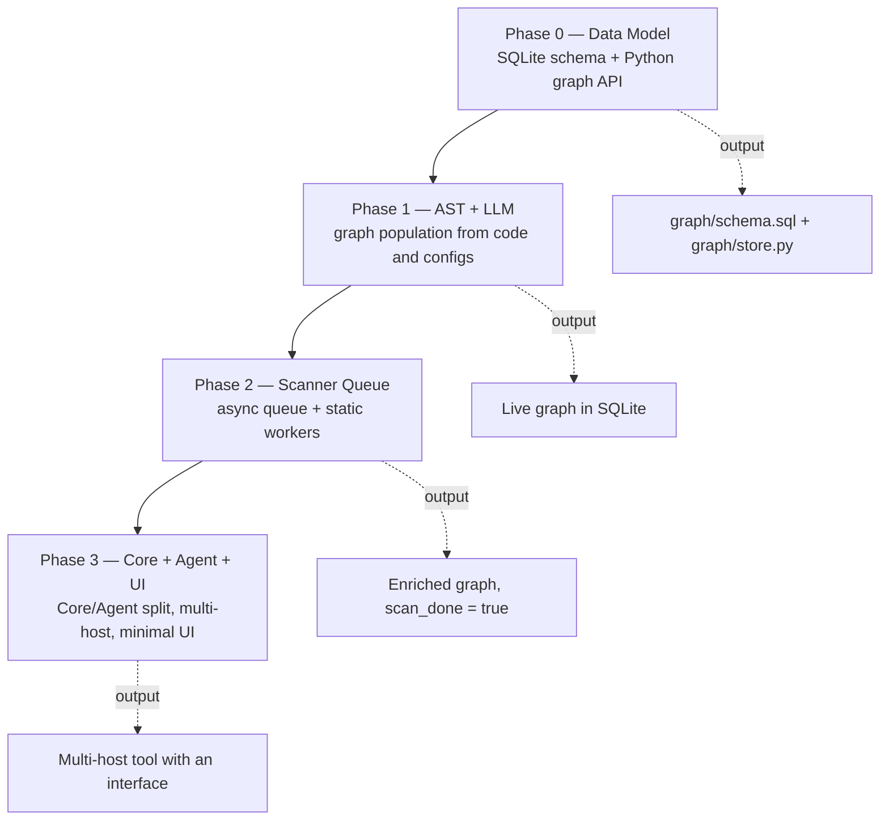
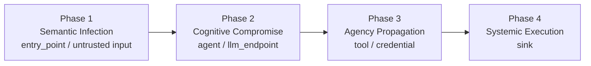
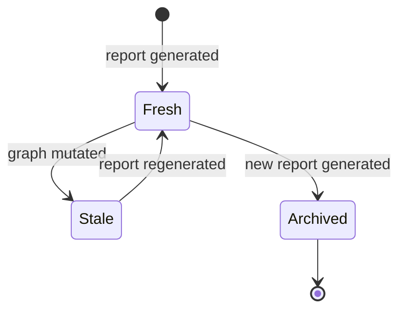

# AICorellator

**AI Infrastructure Attack Surface Correlator** — a correlation tool for AI infrastructure that finds **compromise chains** in systems with AI components.

Not a CVE scanner. Not SAST. Not a runtime IDS. The goal is to build a graph of AI tool interactions (agents, LLMs, MCP servers, tools, sinks), enrich its vertices with scanner data, and **evaluate chain exploitability entirely through LLMs**.

---

## What We Look For

A chain in which untrusted input reaches a dangerous action through AI components:

Each node alone is legitimate. The chain is not.

---

## Key Principles

| Principle | Meaning |
|---|---|
| **Graph is alive** | Single, mutable, no versioning. Nodes are added, enriched, marked `stale`. |
| **SQLite is the store** | No alternatives. Cheaper mutations, faster queries, no separate service. |
| **Scanners run on vertices** | Task queue. Each vertex → task. Workers run asynchronously. |
| **Staleness via `confidence`** | Float, not a boolean flag. A node not confirmed by dynamics loses confidence gradually. |
| **Chain evaluation is LLM-only** | No regex. The LLM receives the graph as text and returns chain + reasoning. |
| **Reports on demand** | Not automatic. A full run takes 20–30 minutes, expensive in electricity. |
| **Multi-host via Agent + Core** | One Agent per node. Three delivery adapters: Swarm, K8s, standalone. |

---

## Architecture

### Pipeline

**Phase 1 — Graph Construction.**
Sources (code, configs) → AST parser (TSA/SCIP) → AI tool interaction graph. Nodes: `agent`, `llm_endpoint`, `mcp_server`, `tool`, `credential`, `sink`, `entry_point`. Edges: `uses_model`, `provides_tool`, `delegates_to`, `has_access_to`, `reaches_sink`.

**Phase 2 — Vertex Enrichment (async).**
Task queue. Static workers — AAK (findings on files: taint, MCP config, IPI), LLM-scanner (model, provider, endpoint), MCP-scanner (tool schema, capabilities). Dynamic workers (architectural option) — change-detectors that add new nodes/edges. Each result enriches a node (findings + attributes). Counters: `static.active_count`, `dynamic.last_completed_at`.

**Phase 3 — Chain Discovery and Evaluation (LLM-only).**
Graph → serialize to text → LLM voting ensemble → chain + reasoning + confidence + voters. Tagging by AKC phases and OWASP Agentic (ASI01–ASI10). Status: `active` / `potential` / `stale`.

**Reports.**
`current/` — current report bundle dir. On graph mutation: `current/` → `<timestamp>`, `report_fresh = false`. New report — on demand only.

### Multi-host

One Agent — one node. Three delivery adapters: Docker Swarm Global Service, Kubernetes DaemonSet, standalone systemd/ssh. Core aggregates everything into a single graph keyed by `host_id`.

---

## Development Staging

| Phase | What | Output |
|---|---|---|
| **0** | Data Model — SQLite schema + Python graph API (`nodes`, `edges`, `findings`, `hosts`, `state`, `task_state`; `confidence`, `host_id`, stale logic) | `graph/schema.sql` + `graph/store.py` |
| **1** | AST + LLM — AST parser (TSA → SCIP conditionally) + LLM extractor; graph population from code and configs | Live graph in SQLite |
| **2** | Scanner Queue — async queue + static workers; vertex enrichment with findings | Enriched graph, `scan_done = true` |
| **3** | Core + Agent + UI — Core/Agent split, multi-host, minimal UI, background mode, reports | Multi-host tool with an interface |

---

## Ontology

### Node Kinds

| Kind | Description | Example |
|---|---|---|
| `agent` | AI client or orchestrator | `InvoiceAgent`, `orchestrator` |
| `llm_endpoint` | Running LLM server | `openai:gpt-5-nano`, `ollama:11434` |
| `mcp_server` | MCP server | `findrive`, `systemutils` |
| `tool` | Tool exposed to an agent | `execute_script`, `delete_file` |
| `credential` | Secret visible to a tool | `AWS_SECRET`, `DB_URL` |
| `sink` | Dangerous action | `shell`, `filesystem`, `network` |
| `entry_point` | Entry point | HTTP route, WebSocket, form |

### Edge Kinds

| Kind | Description |
|---|---|
| `uses_model` | Agent uses an LLM endpoint |
| `provides_tool` | Server exposes a tool |
| `delegates_to` | Agent delegates to another agent |
| `has_access_to` | Tool has access to a credential or sink |
| `reaches_sink` | Path reaches a dangerous action |
| `called_by` | Reverse call relation |

### Chain Tagging

**AKC phases (Agentic Kill Chain):**

| Phase | Name | Graph anchor |
|---|---|---|
| 1 | Semantic Infection | `entry_point`, untrusted input |
| 2 | Cognitive Compromise | `agent`, `llm_endpoint` |
| 3 | Agency Propagation | `tool`, `credential` |
| 4 | Systemic Execution | `sink` |

**OWASP Agentic (ASI01–ASI10):**

- ASI02 — Tool Misuse
- ASI05 — Unexpected Code Execution
- ASI07 — Insecure Inter-Agent Communication

---

## Lifecycle Management

### State Flags

| Flag | Set when | Meaning |
|---|---|---|
| `phase1_done` | AST parser finished | Graph built, `report --fast` possible |
| `scan_done` | All static workers finished | Graph enriched, `report --full` possible |
| `report_fresh` | After report generation | `current/` is current |
| `report_fresh = false` | On graph mutation | Graph moved ahead, report is stale |
| `dynamic_enabled` | Architectural option | Dynamic workers enabled |

### Task Counters

| Counter | Behavior |
|---|---|
| `static.active_count` | Drops to 0 → `scan_done = true` |
| `dynamic.last_completed_at` | Does not block `scan_done`, but must complete at least one cycle |

### Reports

- **Generation on demand only.** Slow (20–30 minutes), expensive in resources.
- **Two tiers:** `report --fast` (after Phase 1, partial) and `report --full` (after Phase 2).
- **Archival:** `current/` → `<timestamp>/` on new generation.

### Re-runs

Content-hash of nodes → findings reused if hash matches. Only changed nodes are rescanned. Full rescan is not required.

---

## Current State

**Early alpha.** Development in staging.

| Component | Status |
|---|---|
| Data Model | DONE (Phase 0) |
| AST + LLM | DONE (Phase 1) |
| Scanner Queue | TODO (Phase 2) |
| Core + Agent + UI | TODO (Phase 3) |

---

## License

See `LICENSE`.