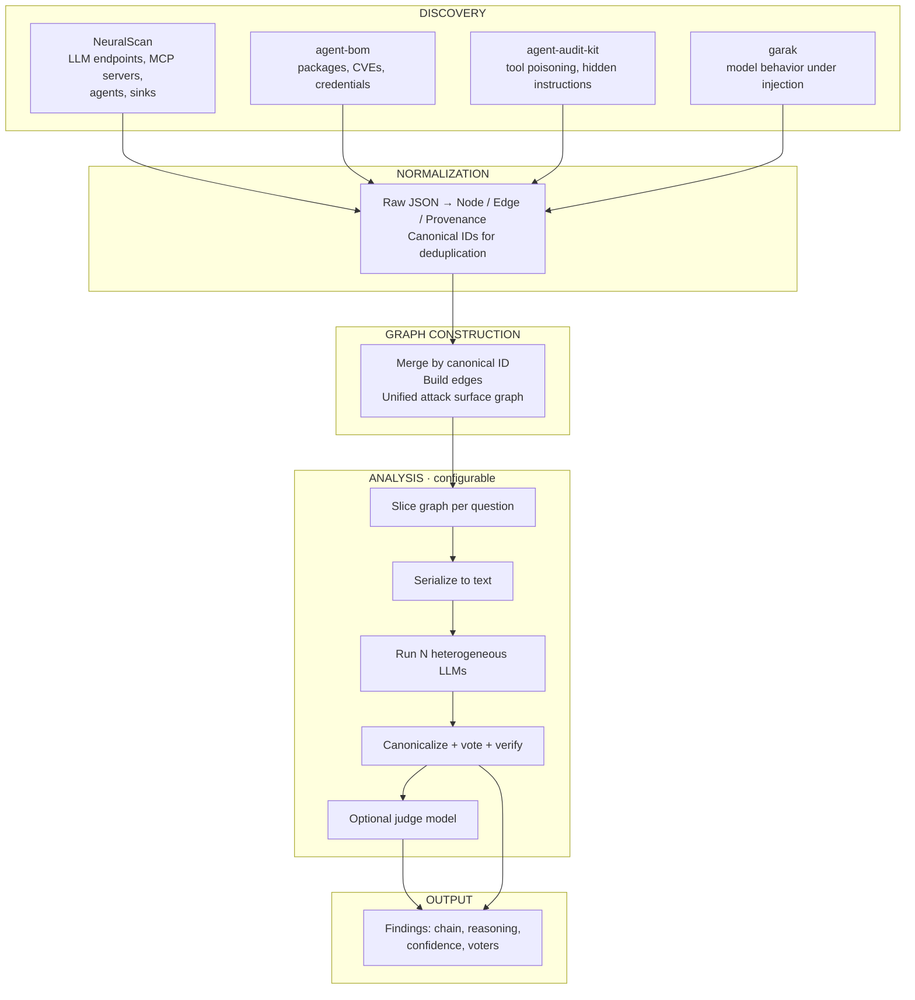

> **Status: POC archived (2026-10-08).**
> This branch contains the proof-of-concept. It demonstrated the viability of
> the correlator approach but revealed architectural incompatibilities between
> modules (NeuralScan, AAK, garak) and no path to scalability.
> Development continues on branch `alpha`. This POC is preserved for
> reference only.

# AICorellator
**AI Infrastructure Attack Surface Correlator**

A modular pipeline that correlates AI infrastructure scan data into exploitability chains. It ingests output from discovery tools (NeuralScan, agent-bom, agent-audit-kit) and LLM behavioral scanners (garak), normalizes everything into a unified graph of nodes (LLM endpoints, MCP servers, tools, credentials, agents, processes, sinks) and edges (access, delegation, exposure, reach), then uses a voting ensemble of heterogeneous local LLMs to identify multi-hop attack chains that no single scanner can see.

Built for both red and blue teams: fast profile for quick reconnaissance, deep profile for thorough audit with prioritized findings.

**Current state: early alpha.**

neuralscan - works locally
agent-bom - TODO
agent-audit-kit - TODO
garak - TODO
LLM evaluation - works locally

---

## What AICorellator is not

**Not an external scanner.** AICorellator does not scan networks, hosts, or services by itself. It consumes output from discovery tools that already ran. If you need to find what is running on a remote host, you use NeuralScan, AASM, or scout-ai first — AICorellator works with their results, not instead of them.

**Not a replacement for SAST, DAST, or SCA.** It does not analyze source code, does not fuzz binaries, and does not check dependencies against CVE databases. Those are inputs. AICorellator correlates their findings with the AI infrastructure layer — MCP servers, tools, credentials, LLM endpoints, agents, and sinks.

**Not a runtime monitor.** It does not intercept traffic between an agent and an MCP server in real time. It operates on snapshots. If you need runtime blocking or live proxy inspection, that is a different class of tool.

**Not a replacement for human judgment.** It produces candidate chains, not verdicts. Every finding carries provenance and a chain that can be verified. The final decision — whether a chain is exploitable in your specific environment — remains with the analyst.

**No external API calls for analysis.** All correlation runs on local LLMs via Ollama or vLLM. No data leaves the machine during the analysis phase.

---

## Network scanning: current scope and roadmap

AICorellator is **local-first**. The current design assumes access to the host where AI infrastructure runs — configuration files, running processes, local endpoints. This covers the most common case: auditing your own deployment, or post-exploitation reconnaissance after initial access has been obtained by another team.

**Network scanning is not in the first iteration.** The reasons are deliberate:

- **Discovery of remote AI infrastructure is a separate problem.** Tools like AASM and scout-ai already solve it. Duplicating that logic inside AICorellator would add complexity without adding value.
- **The graph model is already network-agnostic.** Nodes have a `source` attribute (`local` or `network`) and a `host` attribute. When network discovery is added, the graph schema does not change — only the discovery module.
- **Local-first keeps the attack surface of the tool itself minimal.** No listening ports, no credentials for remote hosts, no agent deployed on target machines. This is a deliberate security trade-off: the tool that audits AI infrastructure should not itself become a target.

When network scanning is added, it will be as a separate discovery module that feeds into the same normalization layer. The pipeline does not change. Profiles do not change. Findings do not change. Only the input source changes.

**Priority for network scanning is low** because the primary use cases — internal audit and post-exploitation reconnaissance — are already covered by local discovery. Network scanning is a convenience, not a requirement.

---

## Architecture

### Design Principles

1. **Stateless core, filesystem as storage.** No database. Each scan is an immutable snapshot written as JSON/JSONL to a timestamped directory. History is a list of snapshots. Diffing snapshots reveals changes over time.
2. **Normalize on input, not on output.** Every external tool emits its own JSON schema. AICorellator never works with those schemas directly. Each tool has a dedicated normalizer that converts its output into the internal `Node`/`Edge`/`Provenance` model. The correlator only sees the internal model.
3. **Graph is the source of truth.** Nodes are entities. Edges are relationships. Findings are not stored as facts — they are derived from graph traversal and LLM analysis.
4. **Provenance everywhere.** Every node, edge, and finding carries provenance: which tool reported it, when, and with what evidence. Without provenance, false positives cannot be debugged.
5. **Configurable analytical layer.** The same graph can be analyzed in different modes. Red team needs speed and recall. Blue team needs depth and prioritization. The analysis layer is driven by profiles, not hardcoded logic.

### Pipeline



### Data Model

**Node kinds**

| Kind | Description | Example |
|---|---|---|
| `agent` | AI client or orchestrator | Claude Desktop, ChatGPT, Copilot, Perplexity |
| `llm_endpoint` | Running LLM server | Ollama on `:11434`, vLLM on `:8000` |
| `mcp_server` | MCP server process | `finbot-tools`, stdio or HTTP |
| `tool` | Connector or extension exposed to an agent | GitHub connector, filesystem extension |
| `credential` | Environment variable or secret visible to a tool | `AWS_SECRET`, `DB_URL` |
| `process` | Running process on the host | LM Studio, Ollama daemon |
| `sink` | Data destination reachable from a tool | `files`, `network`, `machine` |
| `security_findings` | list[dict] | Findings from static analyzers (agent-audit-kit, garak) |

**Edge kinds**

| Kind | Description | Example |
|---|---|---|
| `uses_client` | Agent connects to a hub or another agent | Claude → AI hub |
| `provides_tool` | Server or agent exposes a tool | MCP server → `read_file` |
| `has_access_to` | Tool can reach a credential or sink | `read_file` → `files` sink |
| `delegates_to` | Agent delegates to another agent | Invoice agent → Payment agent |
| `uses_model` | Agent or tool uses an LLM endpoint | Invoice agent → Ollama `:11434` |
| `runs_on` | Node is hosted on a process or host | MCP server → host process |

**Scan** — immutable snapshot of one pipeline run.

| Field | Type | Description |
|---|---|---|
| `id` | string | Timestamp, e.g. `20261005_143052` |
| `host` | string | `localhost` \| IP \| domain |
| `mode` | string | `local` \| `network` |
| `tools_used` | list | `["neuralscan", "agent-bom", ...]` |
| `nodes` | list[Node] | Entities |
| `edges` | list[Edge] | Relationships |
| `findings` | list[Finding] | Derived chains |

**Node** — entity in the graph.

| Field | Type | Description |
|---|---|---|
| `id` | string | Canonical, e.g. `llm:ollama:11434`, `tool:read_file` |
| `kind` | enum | See Node kinds table |
| `name` | string | Human-readable name |
| `attributes` | dict | Kind-specific fields |
| `provenance` | list[Provenance] | Who reported it |

**Edge** — relationship between nodes.

| Field | Type | Description |
|---|---|---|
| `source_id` | string | Node.id |
| `target_id` | string | Node.id |
| `kind` | enum | See Edge kinds table |
| `attributes` | dict | Kind-specific fields (e.g. `risk`, `exfil`) |
| `provenance` | list[Provenance] | Who reported it |

**Finding** — derived from graph analysis, not from scanners.

| Field | Type | Description |
|---|---|---|
| `id` | string | Unique |
| `severity` | enum | `critical` \| `high` \| `medium` \| `low` |
| `title` | string | Short description |
| `chain` | list | `[node_id, edge_kind, node_id, ...]` |
| `reasoning` | string | Explanation from LLM |
| `confidence` | float | 0.0–1.0 |
| `voters` | list[string] | Models that found this chain |
| `evidence` | list[Provenance] | Supporting facts |

### Storage Layout

```
~/.aicorellator/
├── scans/
│   └── 20261005_143052/
│       ├── scan.json          # metadata
│       ├── nodes.jsonl        # one node per line
│       ├── edges.jsonl        # one edge per line
│       ├── findings.jsonl     # one finding per line
│       └── raw/               # raw tool outputs
│           ├── neuralscan.json
│           ├── agent-bom.json
│           ├── agent-audit-kit.json
│           └── garak.json
├── profiles/
│   ├── fast.yaml
│   └── deep.yaml
└── config.json
```

JSONL for nodes/edges/findings: append-friendly, streamable, diff-friendly. Raw tool outputs preserved for debugging and audit.


---

## Analysis Layer

**Profiles** control the analytical strategy without changing the pipeline.

```yaml
# profiles/fast.yaml — red team: quick recon
name: fast
models: [qwen3.5-9b]
voting:
  threshold: 1
judge:
  enabled: false
```

```yaml
# profiles/deep.yaml — blue team: thorough audit
name: deep
models: [qwen3.8-27b, gemma4-31b, qwq-32b]
voting:
  threshold: 2
judge:
  enabled: true
  model: qwen3.8-27b
```

**Questions** are YAML templates that define what to look for and which slice of the graph to analyze.

```yaml
# questions/q1_exfil.yaml
id: q1_exfil
title: "Credential exfiltration chains"
slice:
  include_nodes: [credential, tool, sink]
  include_edges: [has_access_to, provides_tool]
  max_hops: 3
prompt: |
  Analyze the graph for credential exfiltration paths.
  GRAPH: {graph_text}
  Return JSON: {"chains": [{"chain": [...], "reasoning": "...", "confidence": 0.0}]}
```
